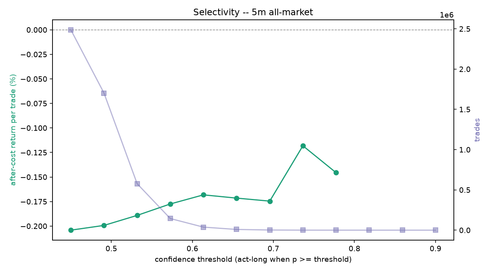

# Edge diagnostics (2026-06-25) -- 5m all-market

## Q1. Pre-cost edge (held-out, fees stripped)
- base rate 0.380 (majority-class accuracy 0.620, informational only)
- model: AUC 0.516 (vs 0.50), accuracy 0.496
- model picks: precision 0.435 vs base 0.380  ->  beats the real balance: True
- 1-bar persistence baseline: precision 0.375, pre-cost -0.018%/trade
- model pre-cost mean return per acted trade +0.033% on 1,594 trades; after-cost -0.167% (cost 0.20% round trip)
- **gate: PASS - a pre-cost edge exists to chase** (beats base True, beats persistence True)

## Q5. Edge stability across eras (after-cost, time-series out-of-fold)
| era | trades | after-cost / trade | win rate |
| --- | --- | --- | --- |
| 2017 launch run-up | 0 | - | - |
| 2018 bear | 0 | - | - |
| 2019-20 base | 0 | - | - |
| 2020-21 bull | 8,390 | -0.170% | 0.42 |
| 2021 top + chop | 14,409 | -0.165% | 0.43 |
| 2022 collapse | 24,227 | -0.174% | 0.43 |
| 2023-24 recovery | 5,924 | -0.151% | 0.46 |
| 2025-26 recent | 6,162 | -0.192% | 0.42 |

## Q6. Selectivity (after-cost return per trade vs confidence threshold)

| threshold | trades | after-cost / trade | win rate |
| --- | --- | --- | --- |
| 0.450 | 2,487,844 | -0.204% | 0.39 |
| 0.491 | 1,702,029 | -0.199% | 0.40 |
| 0.532 | 576,714 | -0.189% | 0.41 |
| 0.573 | 144,223 | -0.177% | 0.42 |
| 0.614 | 37,589 | -0.168% | 0.43 |
| 0.655 | 8,841 | -0.172% | 0.43 |
| 0.695 | 1,760 | -0.175% | 0.43 |
| 0.736 | 252 | -0.118% | 0.46 |
| 0.777 | 16 | -0.146% | 0.44 |
| 0.818 | 0 | - | - |
| 0.859 | 0 | - | - |
| 0.900 | 0 | - | - |

**Selectivity reading:** after-cost return per trade rises - selectivity helps.

