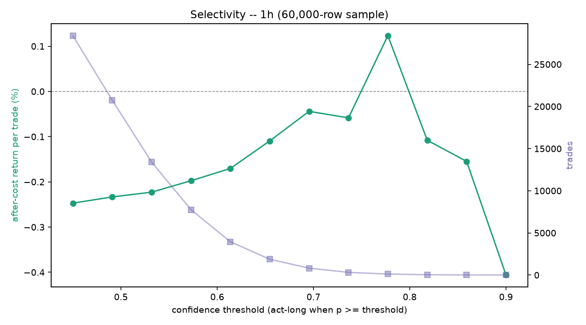

# Edge diagnostics (2026-06-29) -- 1h (60,000-row sample)

## Q1. Pre-cost edge (held-out, fees stripped)
- base rate 0.298 (majority-class accuracy 0.702, informational only)
- model: AUC 0.514 (vs 0.50), accuracy 0.542
- model picks: precision 0.301 vs base 0.298  ->  beats the real balance: True
- 1-bar persistence baseline: precision 0.297, pre-cost -0.142%/trade
- model pre-cost mean return per acted trade -0.185% on 761 trades; after-cost -0.385% (cost 0.20% round trip)
- **gate: FAIL - no pre-cost edge; the problem is features/architecture, not costs** (beats base False, beats persistence False)

## Q5. Edge stability across eras (after-cost, time-series out-of-fold)
| era | trades | after-cost / trade | win rate |
| --- | --- | --- | --- |
| 2017 launch run-up | 0 | - | - |
| 2018 bear | 0 | - | - |
| 2019-20 base | 0 | - | - |
| 2020-21 bull | 100 | -0.135% | 0.33 |
| 2021 top + chop | 714 | -0.172% | 0.34 |
| 2022 collapse | 1,369 | -0.154% | 0.34 |
| 2023-24 recovery | 1,172 | -0.019% | 0.38 |
| 2025-26 recent | 1,665 | -0.295% | 0.32 |

## Q6. Selectivity (after-cost return per trade vs confidence threshold)

| threshold | trades | after-cost / trade | total after-cost | win rate |
| --- | --- | --- | --- | --- |
| 0.450 | 28,411 | -0.247% | -7021.0% | 0.32 |
| 0.491 | 20,757 | -0.233% | -4844.1% | 0.33 |
| 0.532 | 13,413 | -0.223% | -2988.6% | 0.33 |
| 0.573 | 7,761 | -0.198% | -1533.6% | 0.33 |
| 0.614 | 3,949 | -0.170% | -673.0% | 0.34 |
| 0.655 | 1,875 | -0.109% | -205.3% | 0.36 |
| 0.695 | 816 | -0.044% | -35.9% | 0.38 |
| 0.736 | 316 | -0.058% | -18.5% | 0.37 |
| 0.777 | 118 | +0.124% | +14.6% | 0.38 |
| 0.818 | 35 | -0.108% | -3.8% | 0.34 |
| 0.859 | 9 | -0.155% | -1.4% | 0.33 |
| 0.900 | 4 | -0.406% | -1.6% | 0.25 |

**Selectivity reading:** after-cost return per trade rises AND crosses zero -- at p>=0.777 it is +0.124% on 118 trades. A selective operating point clears fees: tune that confidence threshold OUT-OF-SAMPLE (walk-forward) with a minimum-trade floor, judged on TOTAL after-cost P&L (best so far at p>=0.777), not per-trade alone. This is operating-point tuning, not a model retrain.

