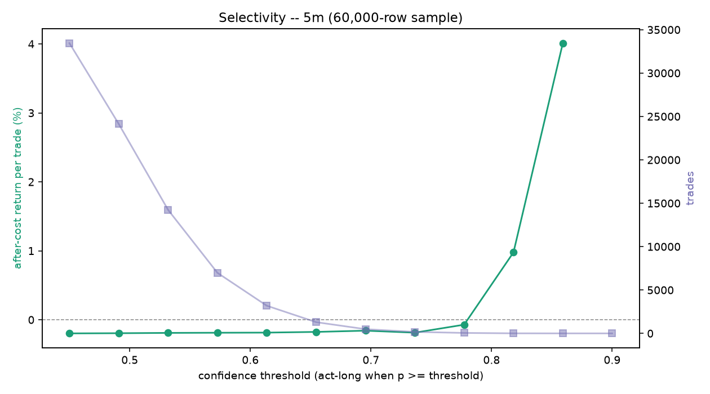

# Edge diagnostics (2026-07-03) -- 5m (60,000-row sample)

## Q1. Pre-cost edge (held-out, fees stripped)
- base rate 0.393 (majority-class accuracy 0.607, informational only)
- model: AUC 0.519 (vs 0.50), accuracy 0.515
- model picks: precision 0.448 vs base 0.393  ->  beats the real balance: True
- 1-bar persistence baseline: precision 0.390, pre-cost -0.006%/trade
- model pre-cost mean return per acted trade +0.024% on 473 trades; after-cost -0.176% (cost 0.20% round trip)
- **gate: PASS - a pre-cost edge exists to chase** (beats base True, beats persistence True)

## Q5. Edge stability across eras (after-cost, time-series out-of-fold)
| era | trades | after-cost / trade | win rate |
| --- | --- | --- | --- |
| 2017 launch run-up | 0 | - | - |
| 2018 bear | 0 | - | - |
| 2019-20 base | 31 | -0.185% | 0.39 |
| 2020-21 bull | 440 | -0.198% | 0.36 |
| 2021 top + chop | 572 | -0.121% | 0.45 |
| 2022 collapse | 961 | -0.186% | 0.37 |
| 2023-24 recovery | 1,065 | -0.200% | 0.26 |
| 2025-26 recent | 1,106 | -0.209% | 0.34 |

## Q6. Selectivity (after-cost return per trade vs confidence threshold)

| threshold | trades | after-cost / trade | total after-cost | win rate |
| --- | --- | --- | --- | --- |
| 0.450 | 33,449 | -0.198% | -6621.6% | 0.35 |
| 0.491 | 24,131 | -0.195% | -4717.5% | 0.35 |
| 0.532 | 14,232 | -0.191% | -2715.3% | 0.35 |
| 0.573 | 6,978 | -0.189% | -1315.4% | 0.35 |
| 0.614 | 3,189 | -0.187% | -594.9% | 0.34 |
| 0.655 | 1,293 | -0.176% | -228.2% | 0.34 |
| 0.695 | 487 | -0.159% | -77.2% | 0.36 |
| 0.736 | 173 | -0.187% | -32.4% | 0.35 |
| 0.777 | 53 | -0.072% | -3.8% | 0.38 |
| 0.818 | 6 | +0.977% | +5.9% | 0.67 |
| 0.859 | 1 | +4.012% | +4.0% | 1.00 |
| 0.900 | 0 | - | - | - |

**Selectivity reading:** after-cost return per trade rises but stays NEGATIVE at every threshold (-0.198% -> best -0.072% on 53 trades), and the trade count collapses toward the top. The model RANKS well but the frame still loses to fees at every operating point -- selectivity does not rescue it. The lever is a coarser decision frame, new information, or cross-sectional framing, NOT a higher threshold and NOT a model retrain on selectivity.

