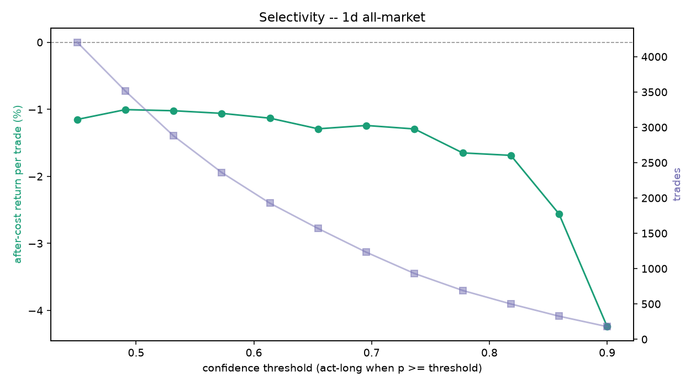

# Edge diagnostics (2026-09-07) -- 1d all-market

## Q1. Pre-cost edge (held-out, fees stripped)
- base rate 0.147 (majority-class accuracy 0.853, informational only)
- model: AUC 0.530 (vs 0.50), accuracy 0.657
- model picks: precision 0.167 vs base 0.147  ->  beats the real balance: True
- 1-bar persistence baseline: precision 0.159, pre-cost -2.299%/trade
- model pre-cost mean return per acted trade -1.150% on 418 trades; after-cost -1.350% (cost 0.20% round trip)
- **gate: FAIL - no pre-cost edge; the problem is features/architecture, not costs** (beats base False, beats persistence True)

## Q5. Edge stability across eras (after-cost, time-series out-of-fold)
| era | trades | after-cost / trade | win rate |
| --- | --- | --- | --- |
| 2017 launch run-up | 0 | - | - |
| 2018 bear | 0 | - | - |
| 2019-20 base | 0 | - | - |
| 2020-21 bull | 0 | - | - |
| 2021 top + chop | 0 | - | - |
| 2022 collapse | 1,142 | -1.849% | 0.22 |
| 2023-24 recovery | 306 | -0.043% | 0.34 |
| 2025-26 recent | 606 | -0.473% | 0.27 |

## Q6. Selectivity (after-cost return per trade vs confidence threshold)

| threshold | trades | after-cost / trade | total after-cost | win rate |
| --- | --- | --- | --- | --- |
| 0.450 | 4,204 | -1.151% | -4838.3% | 0.26 |
| 0.491 | 3,513 | -1.005% | -3528.9% | 0.27 |
| 0.532 | 2,879 | -1.021% | -2939.6% | 0.26 |
| 0.573 | 2,360 | -1.060% | -2502.0% | 0.26 |
| 0.614 | 1,926 | -1.132% | -2180.1% | 0.26 |
| 0.655 | 1,568 | -1.291% | -2023.6% | 0.25 |
| 0.695 | 1,232 | -1.241% | -1528.6% | 0.25 |
| 0.736 | 931 | -1.293% | -1203.6% | 0.25 |
| 0.777 | 691 | -1.650% | -1139.9% | 0.24 |
| 0.818 | 500 | -1.687% | -843.3% | 0.24 |
| 0.859 | 327 | -2.559% | -836.8% | 0.20 |
| 0.900 | 179 | -4.240% | -759.0% | 0.14 |

**Selectivity reading:** after-cost return per trade is flat or falls with the threshold -- the confidence ranking carries no usable selectivity; neither a higher threshold nor a retrain on it helps.

