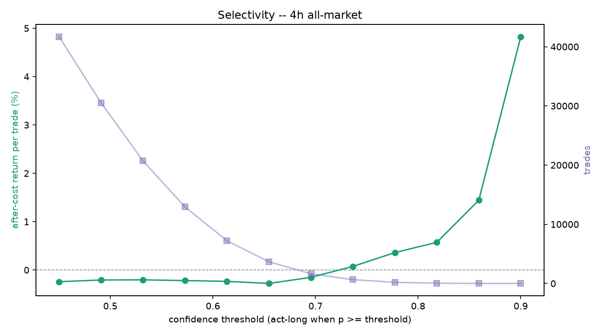

# Edge diagnostics (2026-09-07) -- 4h all-market

## Q1. Pre-cost edge (held-out, fees stripped)
- base rate 0.254 (majority-class accuracy 0.746, informational only)
- model: AUC 0.549 (vs 0.50), accuracy 0.598
- model picks: precision 0.273 vs base 0.254  ->  beats the real balance: True
- 1-bar persistence baseline: precision 0.265, pre-cost -0.118%/trade
- model pre-cost mean return per acted trade -0.182% on 1,748 trades; after-cost -0.382% (cost 0.20% round trip)
- **gate: FAIL - no pre-cost edge; the problem is features/architecture, not costs** (beats base False, beats persistence False)

## Q5. Edge stability across eras (after-cost, time-series out-of-fold)
| era | trades | after-cost / trade | win rate |
| --- | --- | --- | --- |
| 2017 launch run-up | 0 | - | - |
| 2018 bear | 0 | - | - |
| 2019-20 base | 0 | - | - |
| 2020-21 bull | 0 | - | - |
| 2021 top + chop | 0 | - | - |
| 2022 collapse | 1,722 | -0.262% | 0.35 |
| 2023-24 recovery | 3,493 | -0.028% | 0.38 |
| 2025-26 recent | 3,650 | -0.316% | 0.34 |

## Q6. Selectivity (after-cost return per trade vs confidence threshold)

| threshold | trades | after-cost / trade | total after-cost | win rate |
| --- | --- | --- | --- | --- |
| 0.450 | 41,690 | -0.242% | -10096.9% | 0.35 |
| 0.491 | 30,545 | -0.207% | -6316.9% | 0.35 |
| 0.532 | 20,702 | -0.203% | -4207.5% | 0.35 |
| 0.573 | 12,932 | -0.219% | -2832.8% | 0.35 |
| 0.614 | 7,217 | -0.235% | -1695.0% | 0.35 |
| 0.655 | 3,665 | -0.278% | -1020.7% | 0.35 |
| 0.695 | 1,651 | -0.152% | -250.6% | 0.36 |
| 0.736 | 640 | +0.074% | +47.2% | 0.38 |
| 0.777 | 194 | +0.360% | +69.9% | 0.41 |
| 0.818 | 46 | +0.572% | +26.3% | 0.41 |
| 0.859 | 4 | +1.443% | +5.8% | 0.50 |
| 0.900 | 1 | +4.825% | +4.8% | 1.00 |

**Selectivity reading:** after-cost return per trade rises AND crosses zero -- at p>=0.777 it is +0.360% on 194 trades. A selective operating point clears fees: tune that confidence threshold OUT-OF-SAMPLE (walk-forward) with a minimum-trade floor, judged on TOTAL after-cost P&L (best so far at p>=0.777), not per-trade alone. This is operating-point tuning, not a model retrain.

