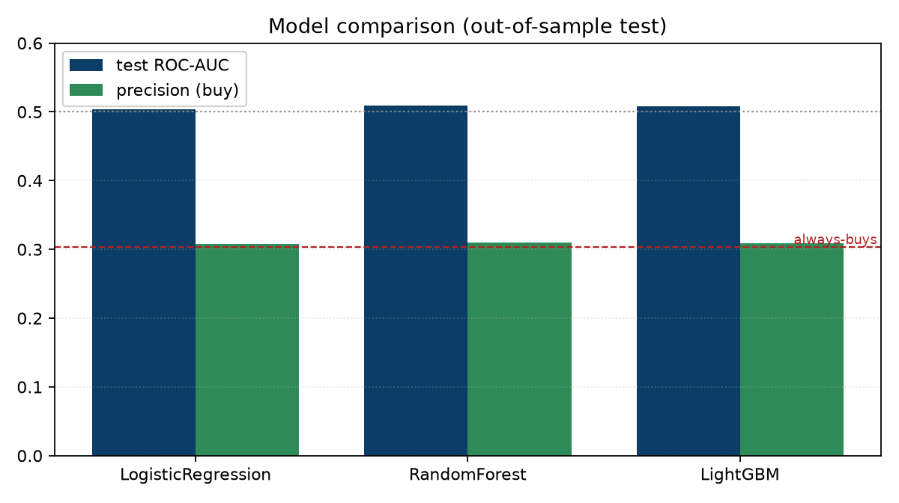
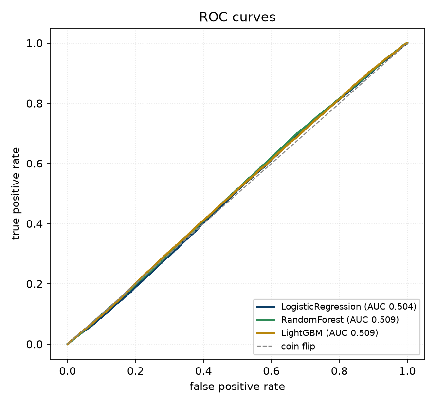
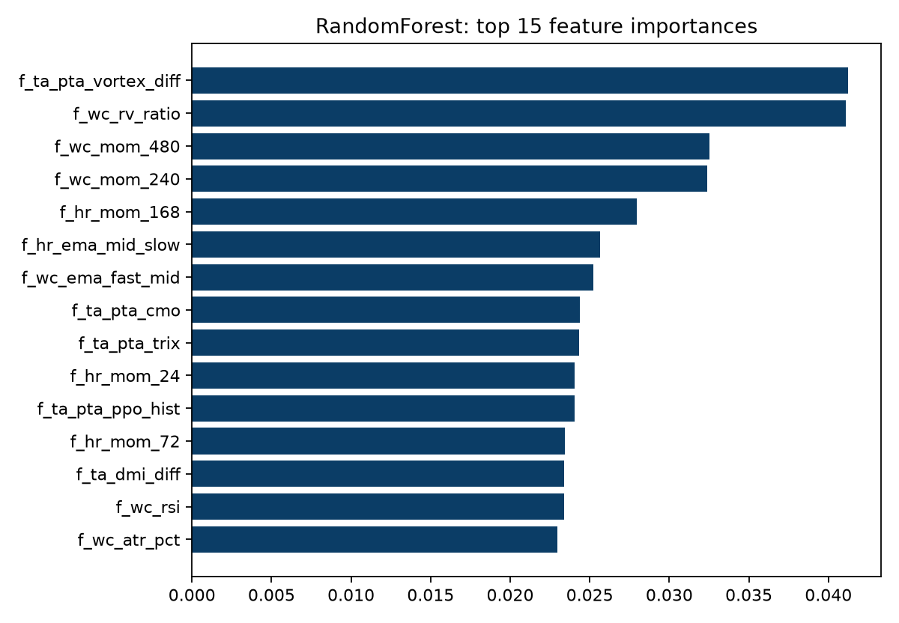
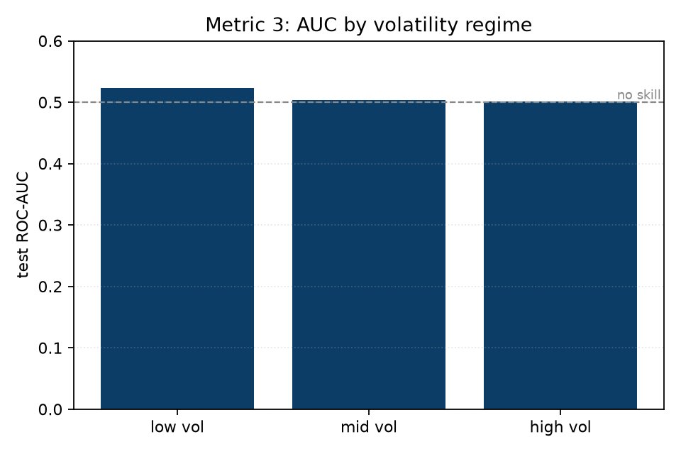
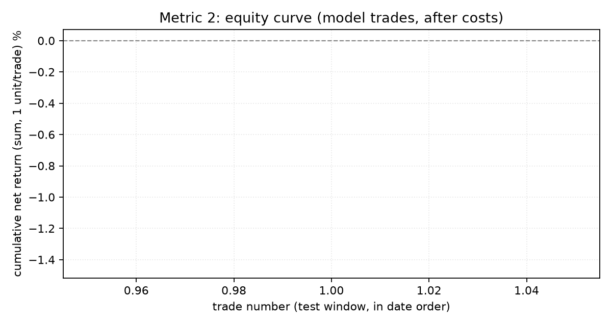

# Head-to-head model comparison (2026-09-08)

**Verdict: NO-GO** - best model **RandomForest**, test AUC 0.509, best-model precision 0.310 vs always-buys 0.303 (precision change +2.1%).

## Dataset and split

| field | value |
| --- | --- |
| rows | 458,539 |
| features | 61 |
| train rows | 381,207 |
| test rows | 76,789 |
| split date | 2025-06-18 |
| embargo (days) | 2 |
| always-buys precision (base rate) | 0.303 |
| confidence band | 0.4 - 0.6 |

## Models, out-of-sample test

Precision is TP/(TP+FP) at the 0.5 threshold; Precision Change (%) is (precision / always-buys - 1) x 100.

| model | CV AUC | test AUC | precision | recall | accuracy | Precision Change (%) |
| --- | --- | --- | --- | --- | --- | --- |
| LogisticRegression | 0.528 | 0.504 | 0.308 | 0.561 | 0.484 | +1.5% |
| RandomForest | 0.526 | 0.509 | 0.310 | 0.557 | 0.489 | +2.1% |
| LightGBM | 0.518 | 0.509 | 0.309 | 0.438 | 0.532 | +1.8% |

## Metric 1: confidence filter (act if p >= hi or p <= lo)

Keller's rule: score only the high-conviction rows we would actually trade. Read precision against always-buys precision (0.303).

| model | coverage | precision | recall | F1 |
| --- | --- | --- | --- | --- |
| LogisticRegression | 3% | 0.281 | 0.660 | 0.394 |
| RandomForest | 1% | 0.000 | 0.000 | 0.000 |
| LightGBM | 27% | 0.294 | 0.349 | 0.319 |

## Metric 3: regime-stratified performance

AUC of the best model within low / mid / high volatility terciles (by 30-day realized volatility). A model that only works in one regime is fragile.

| regime | rows | base rate | test AUC |
| --- | --- | --- | --- |
| low vol | 25,597 | 0.304 | 0.523 |
| mid vol | 25,595 | 0.308 | 0.504 |
| high vol | 25,597 | 0.297 | 0.501 |

## Metric 2: simulated P&L (after costs)

Trades = test days where the model's probability clears 0.60, each held under the +10% / -5% / 20-day triple barrier, minus a 0.20% round-trip cost (Binance.com spot with BNB, plus slippage). Equal-weight, independent trades; position sizing and overlap are the Chapter Two controls' job, not modelled here. The per-trade Sharpe and t-stat say whether the expectancy is signal or noise: |t| above about 2 is the rough bar for significance. The equity curve is the cumulative sum of net trade returns at one unit per trade, not a sized portfolio.

| metric | value |
| --- | --- |
| trades taken (prob >= 0.60) | 1 |
| win rate (net > 0) | 0.0% |
| net expectancy / trade | -1.44% |
| per-trade Sharpe | nan |
| t-stat (expectancy vs 0; |t|>2 ~ significant) | +nan |

## Charts

**Model comparison**

**ROC curves**

**RandomForest feature importance**

**Metric 3: AUC by volatility regime**

**Metric 2: equity curve (after costs)**

