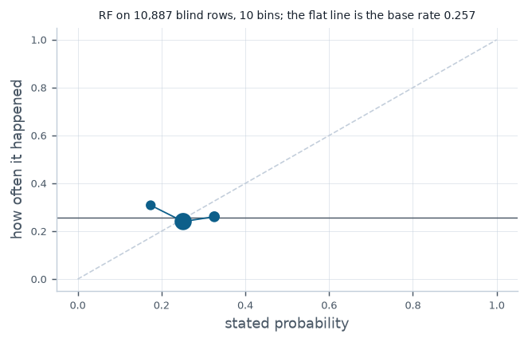
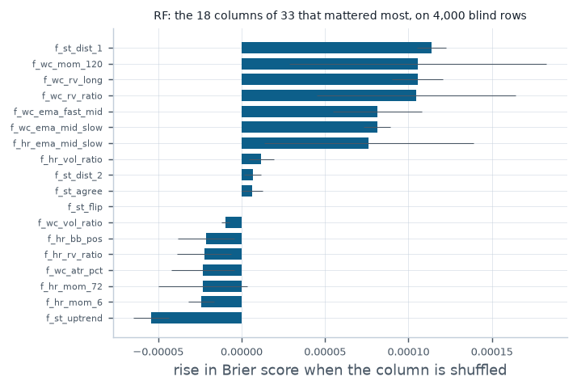

# Bench run, 20 September 2026 22:15

**US equities, hourly bars, first run**

Alpaca US equities, eq1h bars, all symbols, 20,000 most recent in-sample rows. Label 2 ATR take-profit against 1 ATR stop within 12 bars. Split holds out the final 120 days with a label-horizon embargo, 3 expanding folds. No variable screen. Models RF, class weight none, rejecting above a 1.1 overfit ratio.

The outcome scored was the barrier label on the panel, a win when price reached the take-profit before the stop within the horizon.

## The filter

20,000 rows of 12 symbols were read; 19,536 rows of 12 symbols survived Choose Filter and Choose Ranking.

| filter | setting | applied | rows dropped |
| --- | --- | --- | ---: |
| volatility band | 0.001 to 0.05 of price, on f_d1_atr_pct | yes | 96 |
| volume floor | 20,000,000 US dollars a day | yes, from the raw bars | 368 |
| history floor | 30 days after listing | yes | 0 |
| ranking | none chosen | no, no ranking chosen | n/a |

Listing dates read from each symbol's first raw bar: AAPL 2024-01-02, AMZN 2024-01-02, GOOGL 2024-01-02, JPM 2024-01-02, META 2024-01-02, MSFT 2024-01-02, NVDA 2024-01-02, QQQ 2024-01-02, SPY 2025-06-02, XLF 2024-01-02, XLK 2024-01-02, XOM 2024-01-02.

## Scores

Five measures, each computed twice on the same predictions, so Full and CV are read against each other rather than against different quantities. **Full** is fitted and scored in sample on the training window, the optimistic number showing what the model can memorise. **CV** is walk-forward out-of-fold on that same window. The blind period is scored once, at the end, and appears in the second table.

| model | RMSE Full | RMSE CV | MAE Full | MAE CV | MAPE Full | MAPE CV | MISE Full | MISE CV | U2 Full | U2 CV | ratio | verdict |
| --- | ---: | ---: | ---: | ---: | ---: | ---: | ---: | ---: | ---: | ---: | ---: | --- |
| RF max_depth=4 min_samples_leaf=200 n_estimators=150 | 0.4075 | 0.4531 | 0.3428 | 0.3718 | n/a | n/a | 0.00782 | 0.01529 | 0.956 | 1.034 | 1.112 | rejected |

### On the blind period

Scored once. Theil's U1 is bounded on nought to one and nought is a perfect forecast. U2 is the model's error over the error of always predicting the base rate, so below one beats it and above one is worse than doing nothing. The bias share is how much of the squared error comes from the forecast's mean sitting away from the outcome's, which catches a model that is systematically high or low rather than merely noisy.

| model | RMSE | MAE | MISE | Theil U1 | Theil U2 | bias share | AUC |
| --- | ---: | ---: | ---: | ---: | ---: | ---: | ---: |
| RF | 0.4408 | 0.3812 | 0.00464 | 0.575 | 1.009 | 0.000 | 0.492 |

0 of 1 passed the 1.1 overfit bar, which is cross-validated RMSE over training RMSE.


### Fold pass rate

The share of cross-validated folds on which the model's error was below the error of always predicting the training base rate, which is Theil's U2 under one. A pooled total can be carried by one favourable stretch, which is why the bar sits on folds. The bar is 0.6, set on the Choose Ranking tool.

| model | folds scored | folds beating a constant | rate | bar | verdict |
| --- | ---: | ---: | ---: | ---: | --- |
| RF | 3 | 1 | 0.33 | 0.6 | not met |

## Figures

Drawn from the Choose Figures and Signal engines settings on this run's own rows, and written beside this record.

- `figures/bench-20260920-221541-reliability.png`, stated probability against what happened, on the blind period
- `figures/bench-20260920-221541-importance.png`, how much each column mattered, by permutation on the blind period






MAPE is not applicable here. It divides by the outcome and the outcome is nought for the majority class, so the quantity does not exist rather than being large. It is computed and reported on continuous targets such as bars until the trend reverses.

## The configuration that produced this

Every setting, so the run replays from its own record.

```json
{
  "calibration": {
    "bins": 10,
    "cal_fraction": 0.2,
    "methods": [],
    "run_calibration": false
  },
  "data": {
    "bundle": "all",
    "frame": "eq1h",
    "market": "equity",
    "rows": 20000,
    "symbols": ""
  },
  "features": {
    "exclude": "",
    "families": [
      "f_st_",
      "f_wc_",
      "f_hr_"
    ],
    "include": "",
    "max_features": 0
  },
  "label": {
    "flat_band": 0.002,
    "horizon_bars": 12,
    "kind": "barrier",
    "stop_atr": 1.0,
    "target_atr": 2.0
  },
  "model": {
    "class_weight": "none",
    "estimators": [
      "RF"
    ],
    "grid": "learning_rate=0.03,0.06,0.12 max_leaf_nodes=15,31 max_iter=200",
    "params": {
      "RF": {
        "max_depth": 4,
        "min_samples_leaf": 200,
        "n_estimators": 150
      }
    },
    "reject_ratio": 1.1,
    "tune": ""
  },
  "screen": {
    "atr_high": 0.05,
    "atr_low": 0.001,
    "fold_bar": 0.6,
    "min_history_days": 30,
    "min_quote_volume": 20000000.0,
    "rank_signal": "none",
    "rank_tercile": "all"
  },
  "selection": {
    "draw_intervals": true,
    "feed_model": true,
    "l1_ratio": 1.0,
    "rule": "1se",
    "run_selection": false,
    "sel_folds": 10,
    "sel_sample": 25000
  },
  "signals": {
    "candle_decay": 3,
    "confluence_threshold": 2.0,
    "fib_lookback": 240,
    "fib_min_swing_frac": 0.0,
    "ma_fast": 20,
    "ma_slow": 50,
    "macd_confirm_bars": 1,
    "macd_fast": 12,
    "macd_noise_k": 0.5,
    "macd_signal": 9,
    "macd_slow": 26
  },
  "split": {
    "boot_samples": 25,
    "embargo_bars": 0,
    "folds": 3,
    "holdout_days": 120,
    "purge_bars": 0,
    "repeats": 10,
    "scheme": "expanding"
  },
  "viz": {
    "overlays": [],
    "panels": [],
    "theme": "light",
    "viz_bars": 400,
    "viz_symbol": ""
  }
}
```

