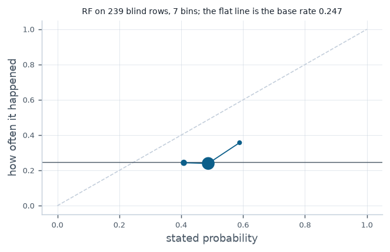
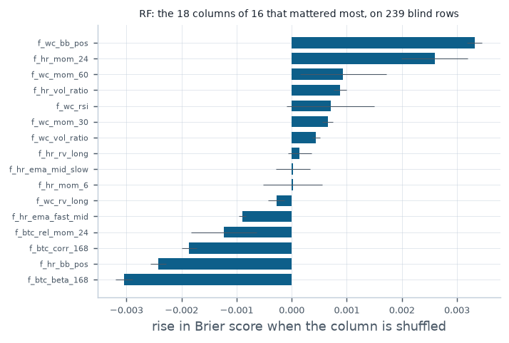

# Bench run, 22 September 2026 19:00

**sept22-a**

Binance spot crypto, 4h bars, 2 symbols (LINK/USDT, LTC/USDT), 6,000 most recent in-sample rows. Label 2 ATR take-profit against 1 ATR stop within 12 bars. Split holds out the final 150 days with 12-bar embargo, 2 monte-carlo folds. An elastic net at l1_ratio 0.7 screened at lambda.min, and the model fitted on the survivors. Models RF, class weight balanced, rejecting above a 1.3 overfit ratio.

The outcome scored was the barrier label on the panel, a win when price reached the take-profit before the stop within the horizon.

## The filter

6,000 rows of 2 symbols were read; 4,059 rows of 2 symbols survived Choose Filter and Choose Ranking.

| filter | setting | applied | rows dropped |
| --- | --- | --- | ---: |
| volatility band | 0.015 to 0.071 of price, on f_d1_atr_pct | yes | 1,941 |
| volume floor | 30,000,000 USDT a day | yes, from the raw bars | 0 |
| history floor | 157 days after listing | yes | 0 |
| ranking | none chosen | no, no ranking chosen | n/a |

Listing dates read from each symbol's first raw bar: LINK/USDT 2019-01-16, LTC/USDT 2017-12-13.

## Scores

Five measures, each computed twice on the same predictions, so Full and CV are read against each other rather than against different quantities. **Full** is fitted and scored in sample on the training window, the optimistic number showing what the model can memorise. **CV** is walk-forward out-of-fold on that same window. The blind period is scored once, at the end, and appears in the second table.

| model | RMSE Full | RMSE CV | MAE Full | MAE CV | MAPE Full | MAPE CV | MISE Full | MISE CV | U2 Full | U2 CV | ratio | verdict |
| --- | ---: | ---: | ---: | ---: | ---: | ---: | ---: | ---: | ---: | ---: | ---: | --- |
| RF max_depth=3 n_estimators=37 | 0.4853 | 0.4902 | 0.4828 | 0.4871 | n/a | n/a | 0.06181 | 0.04760 | 1.110 | 1.098 | 1.010 | passes |

### On the blind period

Scored once. Theil's U1 is bounded on nought to one and nought is a perfect forecast. U2 is the model's error over the error of always predicting the base rate, so below one beats it and above one is worse than doing nothing. The bias share is how much of the squared error comes from the forecast's mean sitting away from the outcome's, which catches a model that is systematically high or low rather than merely noisy.

| model | RMSE | MAE | MISE | Theil U1 | Theil U2 | bias share | AUC |
| --- | ---: | ---: | ---: | ---: | ---: | ---: | ---: |
| RF | 0.4926 | 0.4897 | 0.06394 | 0.502 | 1.142 | 0.226 | 0.506 |

**Chosen: RF** max_depth=3 n_estimators=37, by the lowest held-out error among the fits that passed the overfit bar. caret calls this the selectionFunction and this run used `best`.


1 of 1 passed the 1.3 overfit bar, which is cross-validated RMSE over training RMSE. The best of those on held-out error is RF.


### Fold pass rate

The share of cross-validated folds on which the model's error was below the error of always predicting the training base rate, which is Theil's U2 under one. A pooled total can be carried by one favourable stretch, which is why the bar sits on folds. The bar is 0.6, set on the Choose Ranking tool.

| model | folds scored | folds beating a constant | rate | bar | verdict |
| --- | ---: | ---: | ---: | ---: | --- |
| RF | 2 | 0 | 0.00 | 0.6 | not met |

## Figures

Drawn from the Choose Figures and Signal engines settings on this run's own rows, and written beside this record.

- `figures/bench-20260922-190007-reliability.png`, stated probability against what happened, on the blind period
- `figures/bench-20260922-190007-importance.png`, how much each column mattered, by permutation on the blind period






MAPE is not applicable here. It divides by the outcome and the outcome is nought for the majority class, so the quantity does not exist rather than being large. It is computed and reported on continuous targets such as bars until the trend reverses.

## Variable selection

An elastic net at l1_ratio 0.7 over 2,000 training rows. lambda.min 0.0024116 keeps 16; lambda.1se 0.050623 keeps 0. Screened at lambda.min.

| feature | coefficient |
| --- | ---: |
| f_hr_ema_fast_mid | +0.3231 |
| f_wc_mom_30 | -0.3013 |
| f_hr_mom_24 | +0.2353 |
| f_wc_mom_60 | -0.2260 |
| f_wc_bb_pos | +0.1903 |
| f_hr_ema_mid_slow | -0.1789 |
| f_btc_corr_168 | -0.1223 |
| f_wc_rsi | +0.1008 |
| f_wc_rv_long | +0.0529 |
| f_hr_mom_6 | -0.0482 |
| f_hr_vol_ratio | +0.0395 |
| f_hr_bb_pos | -0.0278 |
| f_btc_rel_mom_24 | +0.0118 |
| f_hr_rv_long | +0.0011 |
| f_btc_beta_168 | -0.0000 |
| f_wc_vol_ratio | -0.0000 |

## Calibration

Fitted on 2,862 rows, mapping fitted on a held-out 954, scored once on the 239-row blind period. Base rate 0.247.

| mapping | ECE | MCE | Brier | reliability | resolution | uncertainty |
| --- | ---: | ---: | ---: | ---: | ---: | ---: |
| raw | 0.2230 | 0.4618 | 0.2528 | 0.06780 | 0.00359 | 0.1859 |
| Platt | 0.0392 | 0.1330 | 0.1913 | 0.00358 | 0.00111 | 0.1859 |

## The configuration that produced this

Every setting, so the run replays from its own record.

```json
{
  "calibration": {
    "bins": 7,
    "cal_fraction": 0.25,
    "methods": [
      "Platt"
    ],
    "run_calibration": true
  },
  "data": {
    "bundle": "all",
    "frame": "4h",
    "market": "crypto",
    "rows": 6000,
    "symbols": "LINK/USDT LTC/USDT"
  },
  "features": {
    "exclude": "F_HR_RV_LONG",
    "families": [
      "f_wc_",
      "f_hr_",
      "f_btc_"
    ],
    "include": "F_ST_AGREE",
    "max_features": 20
  },
  "label": {
    "flat_band": 0.002,
    "horizon_bars": 12,
    "kind": "barrier",
    "stop_atr": 1.0,
    "target_atr": 2.0
  },
  "model": {
    "class_weight": "balanced",
    "estimators": [
      "RF"
    ],
    "grid": "learning_rate=0.03,0.06,0.12 max_leaf_nodes=15,31 max_iter=200",
    "params": {
      "RF": {
        "max_depth": 3,
        "n_estimators": 37
      }
    },
    "reject_ratio": 1.3,
    "tune": "",
    "tune_length": 0
  },
  "screen": {
    "atr_high": 0.071,
    "atr_low": 0.015,
    "fold_bar": 0.6,
    "min_history_days": 157,
    "min_quote_volume": 30000000.0,
    "rank_signal": "none",
    "rank_tercile": "all"
  },
  "selection": {
    "draw_intervals": false,
    "feed_model": true,
    "l1_ratio": 0.7,
    "rule": "min",
    "run_selection": true,
    "sel_folds": 2,
    "sel_sample": 2000
  },
  "signals": {
    "candle_decay": 3,
    "confluence_threshold": 2.0,
    "fib_lookback": 240,
    "fib_min_swing_frac": 0.0,
    "ma_fast": 20,
    "ma_slow": 50,
    "macd_confirm_bars": 1,
    "macd_fast": 12,
    "macd_noise_k": 0.5,
    "macd_signal": 9,
    "macd_slow": 26
  },
  "split": {
    "boot_samples": 3,
    "embargo_bars": 12,
    "folds": 2,
    "holdout_days": 150,
    "purge_bars": 6,
    "repeats": 2,
    "scheme": "monte-carlo",
    "selection": "best",
    "train_fraction": 0.75
  },
  "viz": {
    "overlays": [],
    "panels": [],
    "theme": "light",
    "viz_bars": 400,
    "viz_symbol": ""
  }
}
```

