# Trader Workflow

A research system for selective swing trading on spot crypto, now extending to US equities through
Alpaca paper trading (the [Backup Tracks](#backup-tracks)), consolidated from three notebooks:
**01 Trader Metrics**, **02 Trader Controls**, and **03 Trader Execution**. It is
analysis-only. It reads public prices, decides what is worth trading and how much, and tests
whether any of it makes money after fees. It places no real trades. The live switch stays off until a
configuration clears strict out-of-sample thresholds. Spot only, no shorting, no margin, no leverage.

The single question the system exists to answer: is there a rule the model can trade that clears
fees on data it has never seen. The honest current answer is NO-GO. What exists is the scoreboard
that can prove or kill each change, one logged run at a time.


*Guarded MACD on BTC/USDT (hourly). Green triangles mark guarded buys, red mark guarded sells;
the lower panel shows the MACD line, signal line, and histogram.*

The full, runnable consolidation of the three chapters, aligned to the design described here, is
`00-trader-workflow/00-trader-workflow.ipynb` (also exported to `.docx`). This README is its prose
companion.

## Table of Contents

- [Overview](#overview)
  - [Objective](#objective)
  - [The Pipeline](#the-pipeline)
  - [Data Frames](#data-frames)
  - [Hard Rules](#hard-rules)
  - [Running It](#running-it)
- [Trader Metrics](#trader-metrics)
  - [Cross-Sectional Ranking](#cross-sectional-ranking)
  - [Momentum and MACD](#momentum-and-macd)
  - [Trend Signals](#trend-signals)
  - [Exits](#exits)
  - [The Daily Board](#the-daily-board)
- [Trader Controls](#trader-controls)
  - [Four-Gate Screen](#four-gate-screen)
  - [ATR Volatility Band](#atr-volatility-band)
  - [Edge Sizing](#edge-sizing)
  - [Stacked Defences](#stacked-defences)
  - [Signal Journal](#signal-journal)
  - [Frozen Harness](#frozen-harness)
- [Trader Execution](#trader-execution)
  - [Survivorship Pipeline](#survivorship-pipeline)
  - [Multi-Resolution Frames](#multi-resolution-frames)
  - [Feature Families](#feature-families)
  - [Trade Visualizations](#trade-visualizations)
  - [Model Assessment](#model-assessment)
  - [Stability](#stability)
  - [Edge Diagnostics](#edge-diagnostics)
  - [Regime Conditioning](#regime-conditioning)
  - [Edge Levers](#edge-levers)
- [Shared Method](#shared-method)
- [Findings](#findings)
- [Backup Tracks](#backup-tracks)
- [Committee Layer](#committee-layer)
- [Appendices](#appendices)
  - [File Map](#file-map)
  - [Glossary](#glossary)
  - [Environment](#environment)
  - [Report Generation](#report-generation)

## Overview

### Objective

The goal is one trading strategy that makes money after fees on data it has never seen. Every stage
serves that test, and nothing is accepted without passing it. A candidate is scored on a blind final
year held out from all training and tuning, and it counts only if it beats a coin flip at the real
base rate, beats buy and hold, and returns more than zero per trade after the round-trip fee of about
0.20 percent. A rule that ranks trades well but loses to the fee is a NO-GO. The fee is the adversary,
not the market.

The search runs across three decision frames so intraday, interday, and longer holding each get a fair
test. A frame is a whole system: its own bars, its own label, its own features, scored on its own
out-of-sample. The frames are compared, never pooled, because a five-minute label and a four-hour label
do not mean the same thing.

### The Pipeline

The work splits into three chapters that run in order, each handing a clean input to the next.

| Chapter | Role | The question it answers | Key outputs |
| --- | --- | --- | --- |
| **01 Trader Metrics** | Signal layer | What is worth measuring on a coin | indicators, entry and exit signals, a ranked shortlist |
| **02 Trader Controls** | Risk and rules layer | What the account is allowed to do | position caps, stops, the daily circuit, the fee model, the four-gate screen |
| **03 Trader Execution** | Modeling and search layer | Whether a tradeable edge survives fees | the datasets, the features, the model, and the after-fee scoreboard |

Metrics defines the vocabulary of signals. Controls sets the boundaries any strategy must live inside,
above all the fee and the loss limits. Execution builds the datasets and the model and runs the honest
test. The controls are not a step bolted on at the end; they are the filter the whole search is judged
against.

### Data Frames

Each frame is built from the same `data.binance.vision` archives into its own Parquet dataset. One
builder retunes its feature windows, its label horizon, and its liquidity and volatility screens per
frame.

| Frame | Bar | Trade style it targets | Default label |
| --- | --- | --- | --- |
| **5m** | 5 minutes | intraday scalps | a shorter ATR barrier, roughly two hours |
| **1h** | 1 hour | day-to-day swings | +2 / -1 ATR triple barrier, two wall-clock days |
| **4h** | 4 hours | multi-day holds | +2 / -1 ATR triple barrier, two wall-clock days |
| **1d** | 1 day | position swings, the fee-count lever | +2 / -1 ATR triple barrier, two daily bars |

The higher-timeframe context shifts with the frame, so a five-minute model still sees the one-hour and
four-hour trend and a one-hour model sees the four-hour and daily trend. That is how each frame gets
multi-resolution information without the datasets being merged. The daily frame was added 2026-08-17 as
the fee-count lever: the survivorship-complete daily archive covers 669 pairs and its baseline dataset
and edge matrix are the current decisive read (see [Edge Levers](#edge-levers)).

### Hard Rules

Every candidate strategy lives inside a fixed set of controls. None is negotiable, and the after-fee
test in the last row overrides any in-sample result. Rows marked *revised* carry the current
adjustments; the rest are unchanged from the charter.

| Control | Setting | Why |
| --- | --- | --- |
| Position cap | 5 percent of equity at entry | one bad name cannot sink the book |
| Default size | half Kelly, a quarter on minimum signals | size to the edge, not the conviction |
| Fat-pitch exception | one position to 10 percent, with reward-to-risk at least 3:1, a named cause, and a written exit | rare, documented, reversible |
| Label geometry *(revised)* | longer-horizon, less fee-punishing triple barrier, replacing the +2 / -1 ATR default | the old label lost before any prediction; fewer round trips cut fee drag |
| Hard stop *(revised)* | ATR-scaled per frame, provisional, replacing the fixed 7 percent | trend protection sized to each coin's volatility, not a flat percent |
| Trailing stop *(revised)* | ATR-scaled per frame, provisional, replacing the fixed 10 percent | lets winners run scaled to volatility; settled by the exit-geometry sweep |
| Regime gate *(new)* | act only when BTC is trending up | deploys the real but drowned cross-sectional signal in the regime where it works |
| Narrow book *(new)* | entries only in coins that carried the out-of-sample gated edge and pass the live liquidity screen | a minority of coins carry all the profit; the average hides it |
| Fee tier *(new)* | maker entries, BNB-discounted fees, measured from the account each run | the achievable 0.15 percent round trip closes half the gap to zero |
| Daily circuit | halt new orders if rolling 24-hour drawdown passes 3 percent | stop the bleeding, existing stops stay live |
| Drawdown ramp | below a 5 percent rolling-week loss, cut new size with each further 1 percent | shrink the book, do not just block it |
| Cash floor | keep at least 10 percent in cash | always able to act |
| Position limit | at most 3 new positions per week | forces selectivity |
| Direction | spot only, never short, never margin, never leverage | the mandate; shorting is logged below as research, not policy |
| Averaging down | never | a loser is exited or held, not fed |
| Anchoring | cost basis never enters hold or sell logic | decide on forward value only |
| The bar | nothing ships unless it beats a coin flip, buy-and-hold, and the fee out of sample | the fee is the adversary |

**Adjustments logged.** Six changes were made to release model potential without adding ruin risk, all
bounded and inside the no-short mandate.

1. **Exit geometry.** The fixed 7 percent hard stop and 10 percent trailing stop become ATR-scaled per
   frame and stay provisional until the exit-geometry sweep, which fits per-coin trailing stops and a
   time-decaying take-profit and scores them after fees. The flat percent ignored each coin's volatility
   and conflicted with the code's existing 5 percent and roughly 8.5 percent ATR stops.
2. **Label.** The default +2 / -1 ATR triple barrier is replaced by a longer-horizon, less fee-punishing
   geometry. The old label had negative unconditional expectancy, a base rate near 0.313 against a
   breakeven near 0.333, so it lost before the model predicted anything.
3. **Regime gate (new control).** Deploy the cross-sectional signal only when BTC is trending up.
   Relative strength is real and broad but drowned by a negative universe baseline, and a regime filter
   is the cheapest in-mandate way to test whether it turns positive.
4. **Longer-horizon frame.** Extend the search toward the daily frame alongside 4h, because coarser
   frames cut the fee count per unit of return. As of 2026-08-17 the daily archive is complete and the
   baseline dataset and edge matrix are in flight.
5. **Fee engineering (2026-08-17).** The modelled cost gains a second, achievable scenario: post-only
   maker entries that pay no spread, BNB-discounted 0.075 percent per side, a 0.15 percent round trip
   (`ACHIEVABLE_COST_PCT` in `inputs/train_model.py`). The live wrapper reads the account's actual maker
   and taker rates and BNB-burn setting at the start of every run and warns when the measured round trip
   exceeds the scenario; the paper book charges the same engineered rate. Measured, never assumed.
6. **Narrow book (2026-08-17).** `inputs/narrow_book.py` intersects the coins that carried the
   out-of-sample gated edge (positive contribution, at least three cohort appearances) with the live
   liquidity screen and writes `memory/narrow-book.json`; `inputs/trade_binance.py` refuses entries
   outside it. Rank broadly, trade narrowly.

**Kept tight, unchanged.** The 5 percent position cap, half-Kelly sizing, the 3 percent daily circuit,
the drawdown ramp, the 10 percent cash floor, the three-new-per-week cap, no averaging down, no
anchoring, and the after-fee bar. These bound survival, not the search. Loosening them would amplify a
model that is still at the coin-flip floor.

**Open research question, not adopted: shorting.** Going long the strong third and short the weak third
would monetize the cross-sectional spread directly, even against a negative baseline. It is left out
because it breaks the spot-only mandate and imports unbounded loss and liquidation risk. If ever tested,
it should be small, market-neutral, unleveraged, and paper-first, still behind the after-fee bar.

### Running It

The chapters run on a MacPorts Python through a project `.venv` kernel. Secrets live in the run
environment, never in the repository: the Binance and Alpaca keys, `BINANCE_TESTNET`, and the single
money switch `LIVE_TRADING`, which stays false until a strategy has earned the right to trade. `LOAD_FRAME`
selects the active frame that the single-frame cells consume; the multi-frame sections loop over 1h, 4h,
and 5m on their own and restore the active frame afterward.

## Trader Metrics

The signal layer measures what is worth trading before any model is trained. It shares Execution's data
spine: price from the survivorship-complete `data.binance.vision` archives, and the universe from the
point-in-time Stage B screen. The scores here are illustrative, a place to build intuition and eyeball
candidates, not a trade trigger. The sections below are the signal families the model actually ranks and
trades on; the runnable daily board is kept as an illustrative within-coin read.

### Cross-Sectional Ranking

The decision-grade ranking is cross-sectional, not within-coin. At each bar it ranks the screened
universe by a strength signal and holds only the top third, reading that cohort's after-fee return
against the market and the bottom third (`inputs/cross_sectional_4h.py`). This is the classic momentum
result: relative strength across coins often carries an edge where predicting each coin in isolation does
not. The universe is thin, a median of five to seven coins per 4h bar, so it ranks into terciles at a
five-coin floor rather than deciles. The finding is real but drowned: most momentum and trend signals
show the top third beating the market and a positive train-and-test-stable spread, yet the universe's own
after-fee baseline is about minus 0.38 percent per trade, so even the best top third stays below zero.

### Momentum and MACD

MACD is not retired; it feeds the model in three forms, each made scale-invariant. As a feature the
builder computes the PPO histogram (`f_ta_pta_ppo_hist`), a scale-free MACD (MACD divided by price) so
coins of very different price compare, alongside TRIX, Vortex, CMO, the Fisher transform, and the Chande
Kroll Stop. As a cross-sectional signal, MACD and PPO are among the strength keys coins are ranked by. As
a standalone rule, `inputs/walkforward.py` trades a daily MACD signal-line cross-up with ATR exits and an
optional MACD cross-down exit; scored after fees its verdict is NO-GO, which is why the model uses MACD as
one ranked feature among many rather than as a trigger.


*The Chapter 1 MACD dashboard: guarded signal state across the screened universe, one row per coin.*


*Momentum divergence matrix: where price and oscillator disagree, coin by coin, the raw material the
cross-sectional ranking consumes.*

### Trend Signals

The trend signals the model reads are the Supertrend family. The triple-Supertrend (`f_st_`) votes three
ATR bands and the EMA-200 gate into agreement, signed distances, and a reversal flip. The Modern Adaptive
Supertrend (`f_mst_`) adds a Kaufman efficiency-ratio regime gate and a commit filter that cuts false
flips by around 80 percent. The first signal not derived from the coin's own price is BTC lead-lag
relative strength (`f_btc_`): BTC's momentum, the coin's momentum relative to BTC, and a rolling beta and
correlation. The honest finding is that the entry rule alone sits at the efficient-market floor on the 1h
frame, which is why the search moved to cross-sectional ranking and a coarser frame.


*The confluence dashboard: Supertrend agreement, EMA side, RSI, and choppiness per coin, the trend
vocabulary the model ranks on.*

### Exits

Exits are ATR-scaled, not signal-based. The stop and trailing stop are sized to each coin's volatility per
frame and settled by the exit-geometry sweep, which fits per-coin trailing stops and a time-decaying
take-profit and scores them after fees. A MACD cross-down was tried as an optional signal exit and left
off by default, so the exit design is volatility geometry, not a momentum trigger.

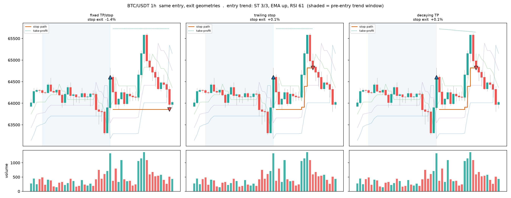

*The same entry under several exit geometries: how the trailing stop's ratchet and the decaying
take-profit change where the trade closes.*

### The Daily Board

The runnable board is the illustrative within-coin read, kept for intuition. It loads daily bars per coin
from the 1h archives, computes a Kalman smoother, Bollinger Bands, Ichimoku, the Archer trend flag, RSI,
Choppiness, and the triple-Supertrend, ranks Supertrend-first, and saves a dated CSV. Stablecoins are
dropped as flat by construction. Treat a green cell as worth a look, checked against the Execution
evaluation, not as a signal in its own right.

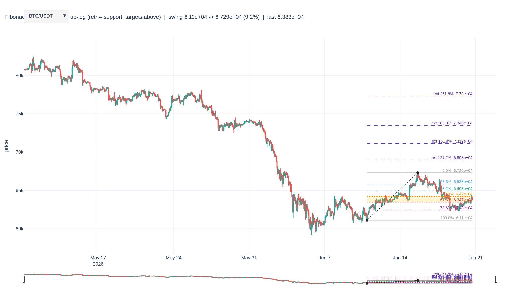

*The Fibonacci retracement dashboard from Chapter 1: level proximity per coin, an illustrative read,
never a trigger.*


*Signal journal: candles with model entries (green) and exits (red) on top, MACD beneath. The HTML
version adds a row-by-row table logging each signal's trend, RSI, volatility, and whether the fee fence
would have allowed the trade.*

## Trader Controls

The risk and rules layer decides which coins are tradable and how large each bet may be. This is a
selective, high-conviction swing design, not a scalper: a trade held for a clean three to five percent
move can absorb a 0.2 percent round trip, a trade chasing half a percent cannot, so the fee is the floor.
The control logic is demonstrated on synthetic OHLCV so it is legible without a data dependency; in
production it consumes the same survivorship-complete archives as the rest of the system.

### Four-Gate Screen

A four-gate screen scopes the tradable market before the model sees a coin. Each candidate must clear
liquidity (24-hour quote volume), the ATR band (lively enough, not detonating), spread (tight enough that
the fee is the binding cost), and history (enough candles to have lived through several regimes). The same
logic is replayed point-in-time across all history (`screen_membership` in `inputs/build_dataset_1h.py`)
to build each frame's training mask, a (coin, bar) row entering the dataset only if it would have passed
as of that bar, with the spread gate approximated by a Corwin-Schultz estimator where the archives carry
no order book.


*The four-gate screen on a live Binance slice: green names clear liquidity, the ATR band, spread, and
history; the rest are rejected with the reason recorded.*

A live run of 2026-06-20 scanned 28 pairs; 9 cleared all four gates. This is the actual screen output, not
a hand-picked list: the passing names change with the market.

| Coin | 24h Vol $M | ATR % | Spread | Candles | Liq (>=$30M) | ATR (2.5-12%) | Spread (<=0.05) | History (>=120) | Result |
|---|---:|---:|---:|---:|:--:|:--:|:--:|:--:|---|
| BTC | 875.0 | 3.33 | 0.0 | 179 | yes | yes | yes | yes | **sample** |
| ETH | 279.0 | 4.72 | 0.0006 | 179 | yes | yes | yes | yes | **sample** |
| SOL | 131.0 | 5.63 | 0.0143 | 179 | yes | yes | yes | yes | **sample** |
| ZEC | 93.0 | 11.18 | 0.0021 | 179 | yes | yes | yes | yes | **sample** |
| XRP | 81.0 | 5.08 | 0.0088 | 179 | yes | yes | yes | yes | **sample** |
| BNB | 56.0 | 3.5 | 0.0017 | 179 | yes | yes | yes | yes | **sample** |
| AVAX | 49.0 | 6.9 | 0.0168 | 179 | yes | yes | yes | yes | **sample** |
| TAO | 38.0 | 9.74 | 0.0438 | 179 | yes | yes | yes | yes | **sample** |
| NEAR | 36.0 | 10.15 | 0.0461 | 179 | yes | yes | yes | yes | **sample** |
| USDC | 902.0 | 0.11 | 0.001 | 179 | yes | no | yes | yes | reject (atr_band) |
| TRX | 42.0 | 1.63 | 0.031 | 179 | yes | no | yes | yes | reject (atr_band) |
| DOGE | 19.0 | 4.79 | 0.012 | 179 | no | yes | yes | yes | reject (liquidity) |

Gate thresholds: liquidity at or above $30M 24-hour quote volume; the ATR band 2.5 to 12 percent; spread
at or below 0.05; history at least 120 daily candles. Scan wide, hold few.

### ATR Volatility Band

ATR(14) read as a percent of price does two jobs with one metric: a selection filter that admits or
rejects a coin, and a live guardrail that keeps the model out of a coin that has drifted out of the
tradable band. The floor sits above the net-edge requirement; the ceiling sits below where a coin gaps
through its stops.

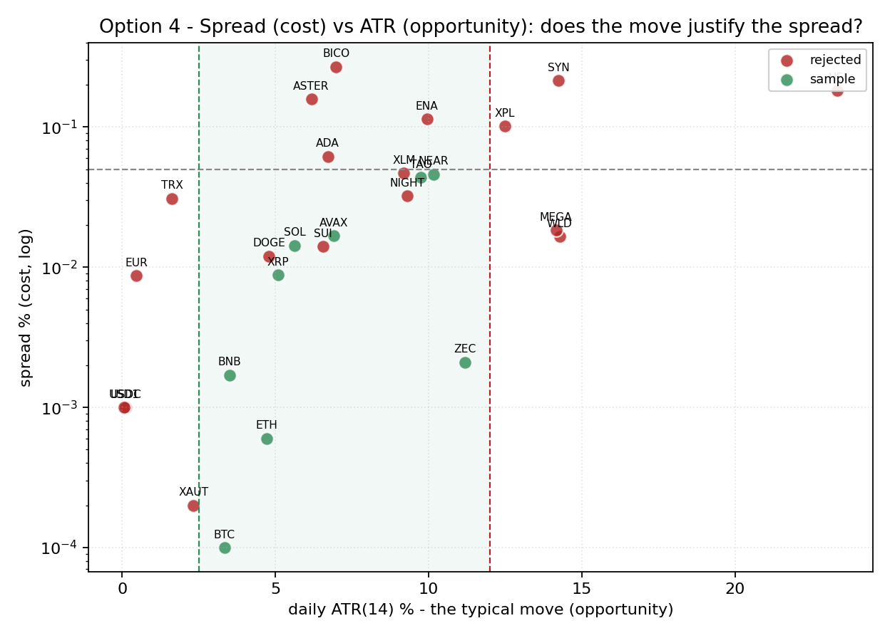

*Round-trip cost against daily ATR per coin: the fee wall drawn literally. A coin below the line cannot
pay for its own typical move.*

### Edge Sizing

The net-edge fence is the entry gate: a trade is refused unless the estimated move minus the round-trip fee
and slippage clears the edge floor, measured on net not gross, refusing rather than warning. Position
sizing is volatility-scaled to keep dollar risk roughly constant across coins, so a higher-ATR coin earns a
smaller clip and a calmer coin a larger one, capped at a fraction of the account and floored at the venue
minimum. The take-profit and stop in the config reference an older fixed label and are provisional pending
the exit-geometry and label sweeps.

### Stacked Defences

The defences are layered, not single: the selection screen keeps unsuitable coins out, the net-edge fence
keeps thin trades out, the ATR band is both a filter and a live guardrail, the position cap and venue
minimum bound each clip, and the per-day trade cap and cash floor bound the book. Above them sit the
revised controls: the ATR-scaled stop and trailing stop, provisional pending the exit-geometry sweep, and
the new regime gate. Each defence is cheap and independent, so a coin must clear all of them and any one
can veto. Together with the after-fee out-of-sample validation, they make volume-hiding, burying thin
losing trades in churn, impossible by construction.

### Signal Journal

A learning aid, not a trader. For each coin it finds every entry and exit the MACD logic produced, draws
the candles with the moving averages and a volume histogram, marks each signal, and writes a table beside
the chart recording what the model saw and whether the fee fence would let the trade fire. Each study sheet
is saved as a self-contained HTML page under `outputs/journal/`, so a visual library builds up on every
run.

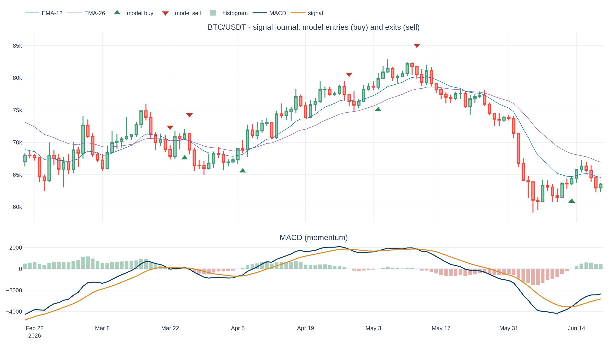

*A journal study sheet for BTC: candles, moving averages, volume, each MACD signal marked, and the fee
fence's verdict recorded beside it.*

### Frozen Harness

The yardstick is frozen and operator-owned. Every walk-forward run appends one line to a log, the
parameters tried, the out-of-sample after-fee result, and whether it was kept or discarded, and the
operator reviews it weekly. The model never writes to the harness or the log, which keeps the evaluation
surface human. The notebook screens and sizes only; no orders are placed and `LIVE_TRADING` stays false.

## Trader Execution

The modeling and search layer builds the survivorship-complete dataset, engineers the features, trains and
grades the model, and tests it the hard way, out of sample and after fees, run per frame. The short version
of the verdict: 1h direction sits at the efficient-market floor, 4h carries a little more signal but still
does not clear costs, and the one genuinely stable opening is cross-sectional relative strength.

### Survivorship Pipeline

Three modules build the panel. Stage A (`inputs/acquire_vision.py`) enumerates the full historical USDT
universe by crawling the `data.binance.vision` archive listing, 612 pairs against the roughly 433 alive
today, so the delisted coins are included rather than silently dropped; it is a checksum-verified,
resumable downloader. Stage B (`inputs/profile_panel.py`) profiles coverage, gaps, the listing timeline,
breadth, and liquidity, and derives the usable start, the minimum history, and the purge and embargo. Stage
C (`inputs/wf_splitter.py`) is the forward-chained walk-forward splitter with train-side purge and embargo
and point-in-time per-fold universes.

### Multi-Resolution Frames

Each bar size is its own dataset. The original 1h frame is kept but superseded by the 4h working frame
(`dataset_4h_allmarket.parquet`, ~567 coins). The frame comparison (`inputs/multiframe_eval.py`) is clear:
4h carries more signal than 1h (AUC about 0.55 versus 0.51) and the daily and weekly context helps, but
every setup is still NO-GO after fees. A 5m scalp frame was added as a research probe for a set of liquid,
lively coins; scalping contradicts the swing thesis and the controls rule it out on the fee wall, so it is
held to the same after-fee bar.

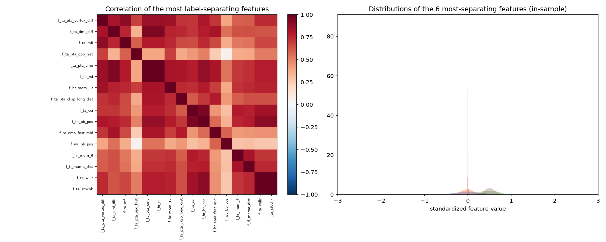

*Exploratory overview of the built dataset: coverage, base rate, and feature distributions at a glance
before any model touches it.*

### Feature Families

Every feature is causal and scale-invariant. The families span an in-house wall-clock and intraday
baseline, extra oscillators, an optional pandas-ta momentum block including the scale-free PPO, an optional
TA-Lib block, the trade-flow imbalance, the triple-Supertrend (`f_st_`), the Modern Adaptive Supertrend
(`f_mst_`), BTC lead-lag relative strength (`f_btc_`), multi-timeframe context (`f_4h_`, `f_d1_`, `f_w1_`),
and the regime state (`f_rg_`). An elastic-net variable-selection pass prunes on the training window before
final fitting.

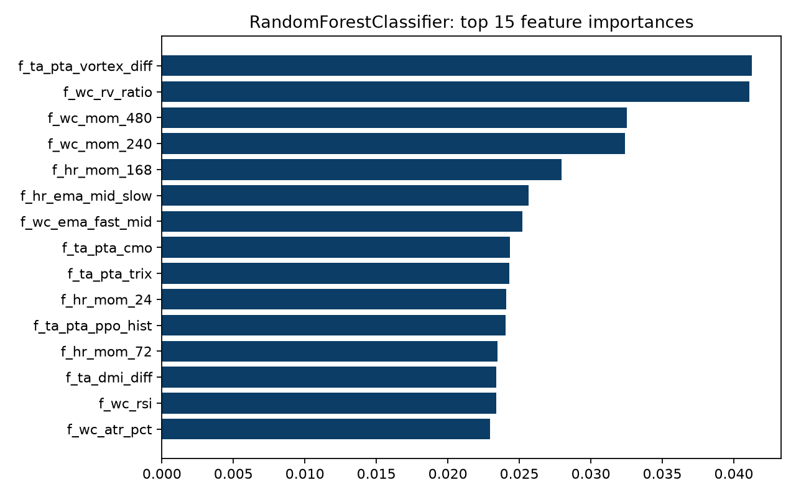

*The strongest tree model's top features: multi-timeframe context and regime state dominate, single-bar
oscillators rank low.*

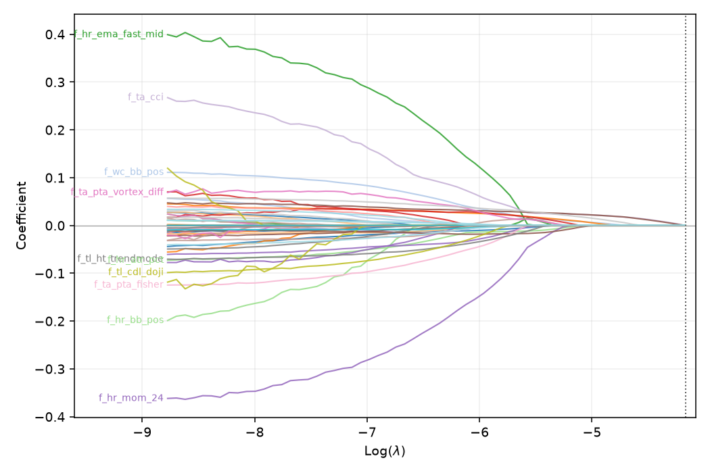

*The elastic-net coefficient path from variable selection: features entering as the penalty relaxes,
fit on the training window only.*

### Trade Visualizations

So the entry and exit points the model is trained on can be read by eye, the notebook draws them on real
candles (single source `inputs/exit_geometry_viz.py`): OHLCV candlesticks with the three Supertrend
trailing bands and the EMA-200, entries and exits marked and coloured by which barrier closed the trade,
across years, regimes, and timeline lengths, each annotated with the trend drivers that fired it.

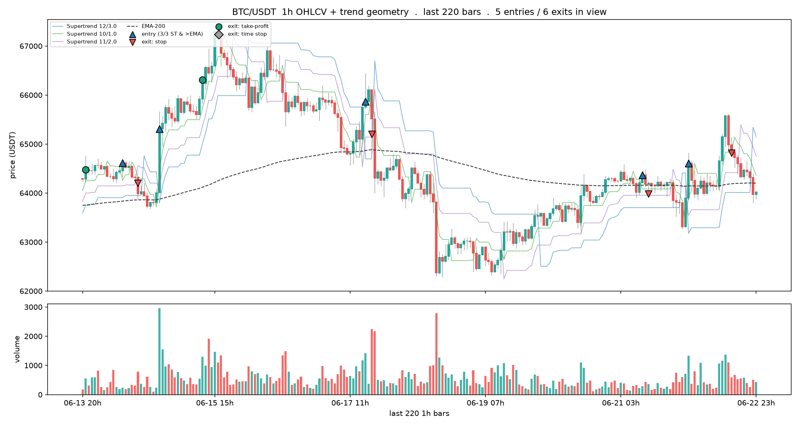

*BTC candles with the three Supertrend trailing bands and the EMA-200: the trend context every entry is
judged against.*

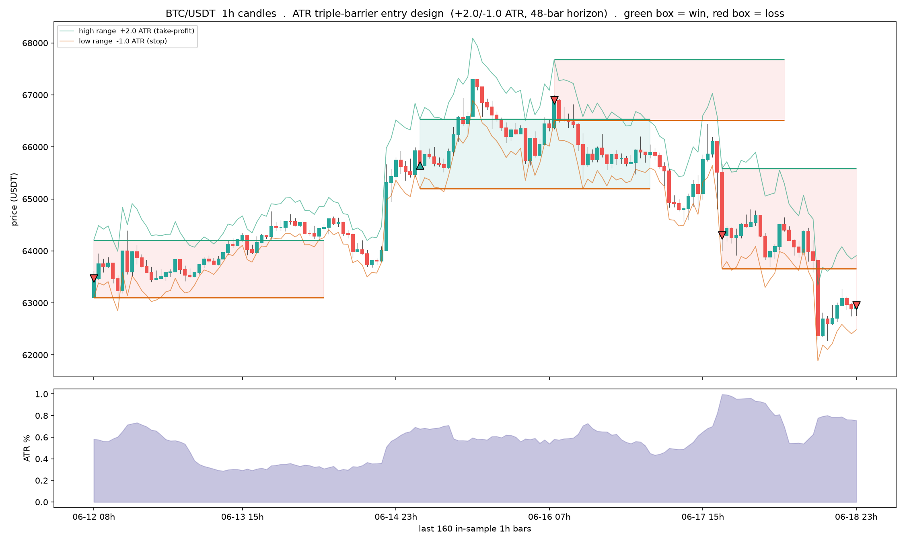

*The ATR triple barrier the labeller draws, on real candles: profit barrier above, stop below, time
barrier at the horizon.*

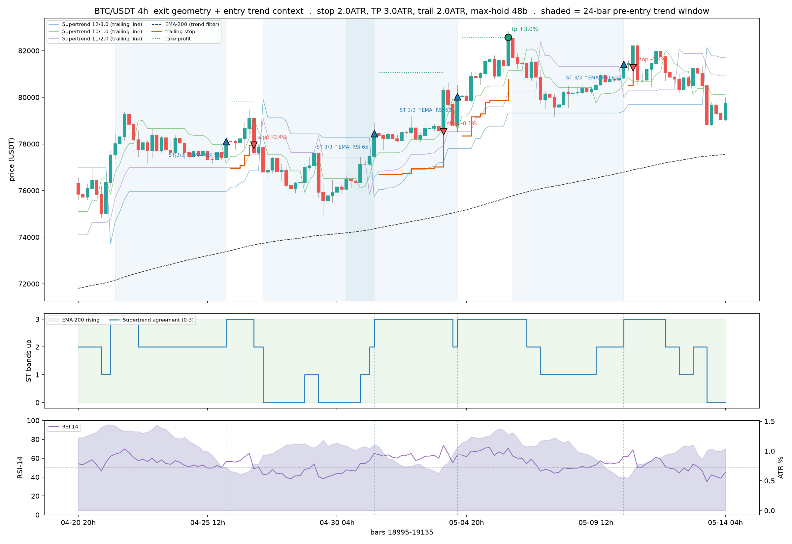

*Exits coloured by reason (stop, take-profit, time) with the pre-entry trend window shaded and the
per-entry Supertrend agreement annotated.*

### Model Assessment

A caret-style scorecard (`inputs/model_assessment_1h.py`) grades a zoo of models, across every built frame,
two ways: in-sample (Full) and time-series cross-validated. Because the label is binary, the error is RMSE
on the predicted probabilities (the square root of the Brier score), and the RMSEratio (Full over CV) flags
overfitting. The cross-validation is expanding-window TimeSeriesSplit, never random folds, and the final
year stays a single blind test. Frames are scored independently and stacked, never pooled.

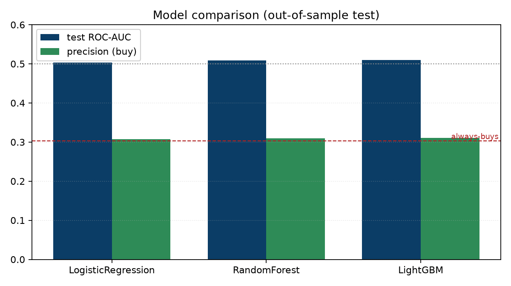

*The model zoo head to head on the blind year: the spread between the best and worst model is small,
because the ceiling is the signal, not the learner.*

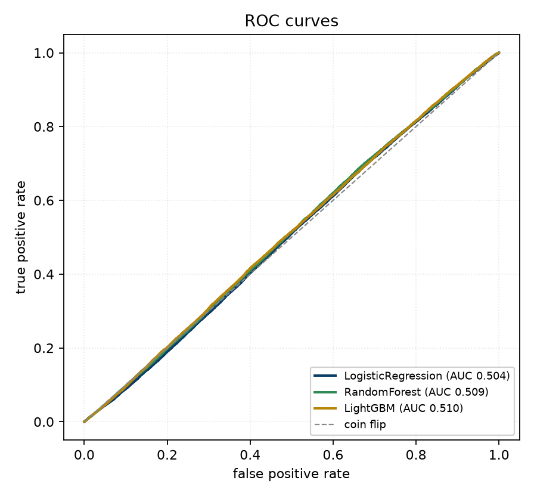

*ROC curves on the held-out year: visibly above the diagonal but shallow, the picture of a ranker
slightly better than chance fighting a fee it cannot beat.*

### Stability

The Monte Carlo robustness gate (`inputs/monte_carlo_1h.py`) resamples the model's held-out confident
trades ten thousand times per frame, reporting total return, drawdown, and Sharpe with their worst-case
percentiles, the probability of a loss, and a sign-flip p-value. A frame is ROBUST only if the
fifth-percentile total is positive, the loss probability is low, and the p-value small. On the current
label every frame reads FRAGILE, the honest reading of a negative-mean series compounded.

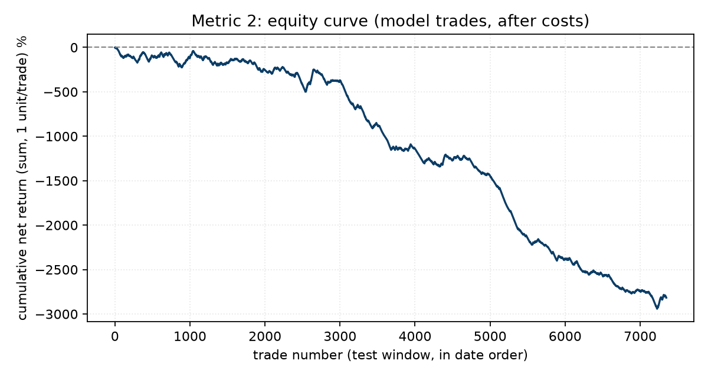

*Compounded equity of the model's confident trades against buy-and-hold on the blind year: the after-fee
line is the one that matters, and it does not climb.*

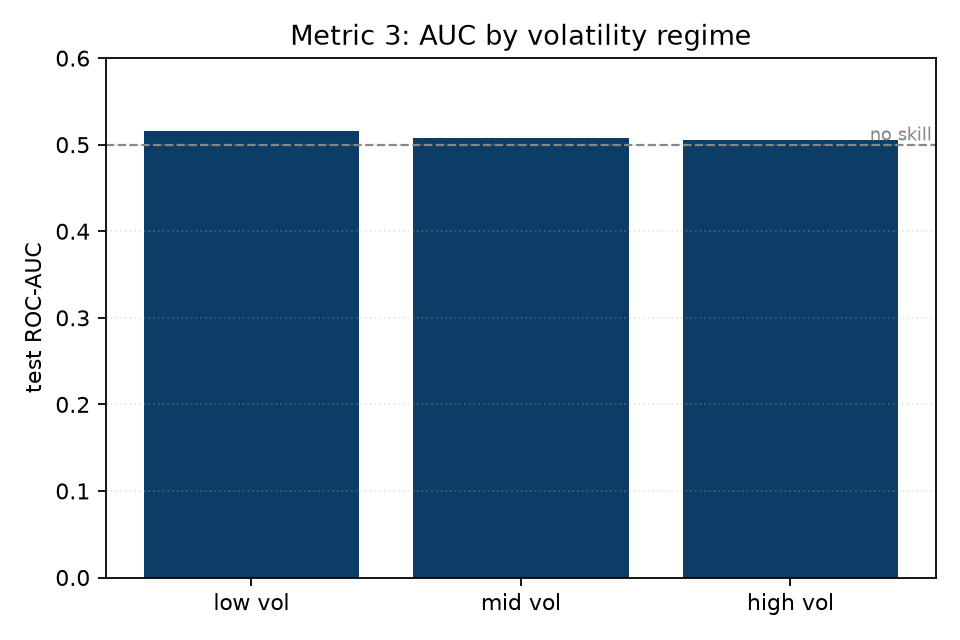

*The same model stratified by market regime: profit concentrates in bull eras and gives back elsewhere,
the pattern the regime gates tried and failed to monetize.*

### Edge Diagnostics

A leakage audit came first and is clean: the label is forward-aligned, scaling is fit train-only, the
features are causal, and the split carries a label-horizon embargo, so the NO-GO is real, not an artifact.
`inputs/edge_diagnostics.py` then answers three questions per frame: whether there is a pre-cost edge
against a coin flip at the real base rate and a one-bar persistence baseline (Q1), whether the edge is
stable across eras (Q5), and whether raising the confidence threshold lifts after-cost return per trade
(Q6). The out-of-sample selectivity test chooses the threshold on train and scores it once on the blind
year, so a thin in-sample peak cannot pass.

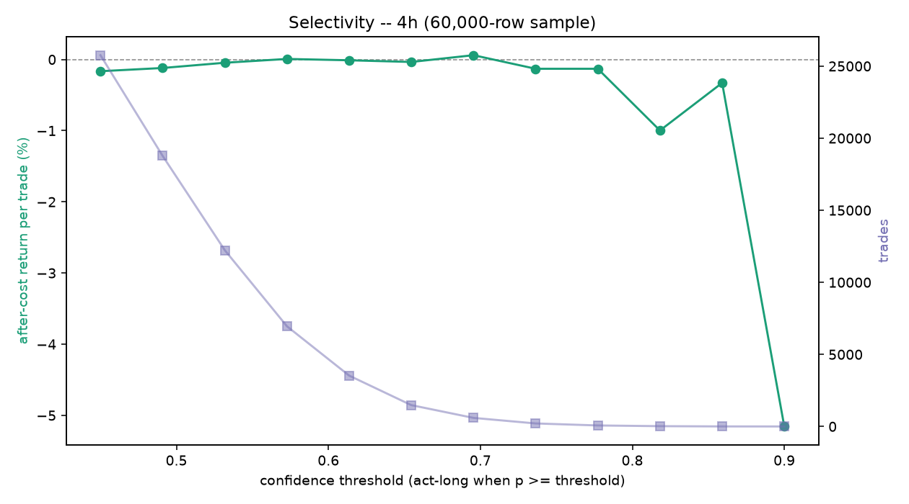

*The Q6 selectivity curve on the 4h frame: after-cost return per trade rises with confidence threshold
but plateaus under zero, the fee line drawn against the model's whole confidence range.*

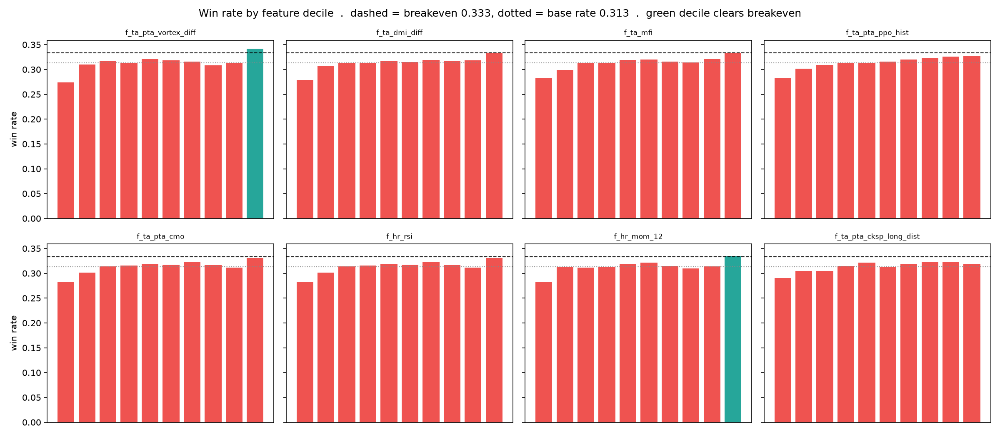

*The entry-sharpening study: which single conditions lift the win rate toward breakeven. Trend and
momentum pay marginally; range and volatility never do.*

### Regime Conditioning

The preferred fix for regime concentration is to condition one model on observable regime state rather than
build a switchboard. `build_dataset_1h.regime_block` adds that state as the `f_rg_` family, and
`inputs/regime_conditioning.py` runs the ablation, the same model with and without it, per frame, reporting
cross-era stability and after-cost edge separately. It clearly improves generalization, more eras
profitable and a less bad worst era, while the headline after-cost still sits below the fee line: a
generalization fix, not a free edge.

### Edge Levers

Added 2026-08-17. Every 4h gate variant lands 5 to 12 basis points short of zero, which locates the
problem in the trading frequency, not the filter: each round trip pays the fee, and at 4h cadence the
edge cannot cover the toll count. Four levers attack that gap, all built.

First, the coarser frame. The survivorship-complete daily archive (669 pairs) feeds
`dataset_1d_allmarket`, and the baseline build chains straight into the same edge matrix
(`inputs/cross_sectional_regime.py --interval 1d`) under both gates and both cost scenarios. Daily bars
pay roughly a sixth of the tolls for a similar directional read.

Second, fee engineering. `ACHIEVABLE_COST_PCT = 0.15` sits beside the conservative 0.20 default;
`trade_binance.fee_status()` measures the account's real commission and BNB-burn state each run rather
than assuming them, and the paper book charges the engineered rate.

Third, the narrow book. `inputs/edge_attribution.py` shows a minority of coins carry all the
out-of-sample gated profit (23 of 59 positive, the top five carrying 30 points) while SOL, XRP, and
PEPE reliably bleed. `inputs/narrow_book.py` writes the evidence-based whitelist to
`memory/narrow-book.json` and the execution layer enforces it.

Fourth, microstructure features. The opt-in `f_ms_` block (`--microstructure`, daily frame only) gives
the daily bar hourly eyes: taker-buy flow imbalance and its seven-day mean, up-hour versus down-hour
volume, volume concentration, close position in the day's range, realized-versus-range volatility, and
three-sigma hourly jump counts. Causal, scale-invariant, validated on synthetic data, and built only
after the baseline daily edge matrix is read so the baseline stays clean.

The gates themselves matter to deployment: the funding-crowding gate (perpetual funding is mechanically
forced positioning information, not derivable from spot price; `inputs/funding_features.py`) is open 47
percent of bars against the breadth gate's 24, at a cost of about two basis points per trade on the
deciding cell. Neither clears zero at 4h; the dated records live under `outputs/AA-evals/`.

**Outcomes, 2026-08-17.** All four levers were executed and scored the same day. The daily frame's
inherited label proved degenerate (two daily bars of room, base rate 0.068); the sweep fixed it at
+3/-1 ATR over 20 days, and even so the gated matrix does not clear, because twenty-day holds inherit
the bear test-year's drift: coarser bars trade fee count against per-trade market exposure. The
microstructure features carry no selection edge (every `f_ms_` cell at or below the market out of
sample); their remaining use is execution timing. The one positive cell the day produced, the adaptive
Supertrend under the breadth gate, was falsified by the pre-registered walk-forward harness
(`inputs/mst_gate_walkforward.py`): fold pass rates 33 and 27 percent against a 60 percent bar, zero of
sixteen tradeable gate widths positive over all history. It is journaled as a closed artifact, and the
fee-engineering and narrow-book work remain in force on the execution side.

## Shared Method

The machinery shared by every chapter, the discipline that keeps them telling one story and keeps the
picture from drifting from the numbers.

- **The multi-frame loop.** The same search runs on 1h, 4h, and 5m, each a whole system, retuned in place
  by one builder. The frames are compared, never pooled. Every modelling section loops over the three
  frames, scores each on its own out-of-sample, and reports one block per frame; cross-timeframe
  information still reaches each frame through causal higher-timeframe features.
- **The after-fee scoreboard.** One test decides everything: beat a coin flip at the real base rate, beat
  buy and hold, and return more than zero per trade after the fee, on a blind final year. Every sweep,
  model, and ablation reports to the same scoreboard under `outputs/AA-evals/`, so no in-sample number can
  override the out-of-sample verdict.
- **Embargoed splits.** Financial bars are autocorrelated, so the evaluation cuts time-ordered: train on
  history before a final-year cut, embargo a band equal to the label horizon across the cut, and score the
  held-out year once. Cross-validation walks expanding time-series folds, never random k-fold.
- **Reproducibility.** Single sources of truth: one exit module shared verbatim across the chapters, one
  Supertrend benchmark and feature family, Parquet storage that preserves dtypes, an offline deterministic
  build from checksummed archives, and a dated record for every evaluation.

## Findings

The honest state of the search. Nothing has cleared the after-fee bar yet.

On the 1h frame, direction prediction sits at the efficient-market floor. The label sweeps, the model zoo,
and the Monte Carlo robustness gate all land NO-GO, the zoo's AUC hovers around 0.50, and the default label
has negative unconditional expectancy, a base rate near 0.313 against a breakeven near 0.333, so it loses
before the model predicts. The 4h frame carries a little more signal, AUC around 0.55 against 0.51, and the
daily and weekly context lifts it further, but it still does not clear the fee out of sample. The 5m scalp
frame is ruled out by the controls layer on the fee wall. The NO-GO is real, not a leakage artifact.

The one genuinely present signal is cross-sectional relative strength: ranking the universe and holding the
top third each bar shows a real and broad edge that holds across train and test, most robustly on the
adaptive-Supertrend direction. But it is not yet a long-only GO, because the universe's own after-fee
baseline is about minus 0.38 percent per trade, so even the best top third beats the market while staying
below zero. The edge exists and is stable; the negative baseline is what sinks it, categorically different
from the time-series entry work that had no stable signal at all.

The gates have since narrowed the gap without closing it. As of 2026-08-17: with the BTC-up plus
breadth gate the best 4h top-third loses 0.097 percent per trade at the standard 0.20 percent cost and
0.047 percent at the achievable 0.15; with the BTC-up plus funding-crowding gate, 0.117 and 0.067
percent, open on twice as many bars (47 against 24 percent). A year of work moved the per-trade line
from minus 0.38 to minus 0.05-0.12 percent; the residual is the toll count of the 4h frame itself,
which is why the daily frame is the decisive next read.

The earlier daily ten-coin walkforward is kept as the baseline the new frames must beat: across 766
out-of-sample trades, expectancy was about plus 0.03 percent per trade with a 74 percent win rate, but ATR
stop-losses averaging minus 8.5 percent cancelled the frequent plus 2.8 percent take-profits, a hair better
than a coin flip and not better than buy-and-hold.

As of 2026-08-17 the crypto search has no open positive candidate. The daily frame, the microstructure
features, and the last surviving gated cell were each executed and killed the same day (see the Edge
Levers outcomes above). What a year of honest testing established: the cross-sectional relative-strength
edge is real and stable but 5 to 12 basis points smaller than crypto's 15 to 20 basis-point round trip,
and no gate, label, frame, or feature family closes that gap. The work moved to attacking the wall
instead of the edge, and one session later the equities track produced the project's first SURVIVES
verdict and a live paper book (see Backup Tracks). The arc in one sentence: crypto proved the machinery
and killed every edge on the fee wall; the same machinery pointed at equities found the oldest edge in
the book alive, affordable, and violent. Shorting is held as research, not policy. The live switch
stays off.

## Backup Tracks

Two tracks, planned in `tasks/workplan-alpaca-hires-2026-08-17.md`, sequenced A then B because A changes
which verdicts are possible while B refines a number that matters only once something clears a bar.

**Track A, Alpaca US equities: complete through A5 and live on paper.** The fee arithmetic was the
argument, and it held: Alpaca charges no commission, so a liquid large-cap round trip costs basis
points, not crypto's fifteen to twenty. All five phases landed 2026-08-17/18. A1 proved the plumbing
(`inputs/alpaca_check.py`). A2 built the data layer (`inputs/alpaca_data.py`): 12,539 active US equities
enumerated, 2,673 passing the $20M dollar-volume screen, maximum-history adjusted daily bars on the SIP
consolidated feed, with the survivor-bias caveat stamped on every output. A3 ran the equity daily frame
through the shared builder unchanged (`inputs/build_dataset_equity.py`, SPY in the market seat). A4
delivered the project's **first SURVIVES verdict**: the first-pass ranked signals were killed by the
walk-forward harness exactly like their crypto cousins, but the pre-registered canonical 12-1 momentum
factor on non-overlapping monthly holds (`inputs/equity_momentum_monthly.py`) passed both 60 percent
fold bars: top decile +2.2 percent per month against the universe's +1.1, t-statistic 2.53 over 115
months. Three checks followed before any deployment: the survivorship stress
(`inputs/equity_survivorship_stress.py`) showed the edge GROWS in the top-500 liquidity tier where
delisting bias is smallest and survives adversarial delisting injection; the portfolio simulation
(`inputs/equity_portfolio_sim.py`) showed 30.5 percent CAGR net of measured turnover costs against
SPY's 17.5, at double the volatility and with a 27.8 percent worst month, which was July 2026, last
month. On the operator's decision, A5 (`inputs/alpaca_trade.py`) went live on the paper account
2026-08-18: 50 names at 1.8 percent each, never short in code, no margin possible by construction, the
10 percent cash floor and 3 percent daily circuit enforced, monthly rebalance. Two charter rules are
explicit switches rather than defaults for this systematic basket, and the deviation is journaled: the
max-3-new-per-week cap and the crypto-calibrated 7 percent per-name stop would forbid a 50-name factor
rebalance; this book's risk controls are diversification, the monthly cadence, the floor, and the
circuit.

**Track B, 1-minute Binance data.** Sub-daily decision frames failed the fee wall, so 1m data enters as
execution timing and measurement only, never as a trading cadence. Scope is the eight majors plus the
narrow book. The centerpiece is a maker-fill simulator mirroring `trade_binance.place_entry` bar for
bar, whose output is the measured achievable round-trip cost per coin, which either validates or
corrects the assumed 0.15 percent that the recent evals lean on.

## Committee Layer

Beside the quant pipeline sits a qualitative research layer: the TradingAgents multi-agent committee
(TauricResearch v0.3.1, a separate repository with its own venv and key), consumed as a pre-market
analysis service and never as an execution trigger. Per symbol it runs market, sentiment, and news
analysts, a bull-versus-bear debate, a risk panel, and a portfolio manager who issues one of five
ratings with a written thesis, automating Principle 1's requirement that every entry carry an
affirmative case and a devil's advocate. The bridge is one wrapper, `inputs/ta_research.py`: ratings
append to `memory/research-log.md`, the framework's self-grading decision log (each call scored against
the realized five-day return on the next same-ticker run) accrues in `memory/ta-decisions.md`, and full
reports land under `outputs/ta-reports/`. The committee's rating is itself a candidate signal held to
the after-fee bar, and its only material effect so far has been to keep the paper book in cash: the
August 16 sweep of the eight majors produced no Buy or Overweight, so the ratings gate
(`paper_trade.py open --from-ratings`) permitted no entries. The paper book itself rehearses execution
against live prices with the hard rules enforced mechanically; it holds one hand-opened SOL mechanics
test, not a committee trade.

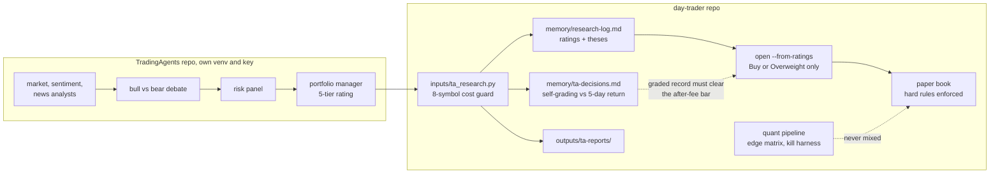

*The integration in one picture: opinions flow left to right into memory files; the ratings gate is the
only door to the paper book, the quant pipeline stays separate, and nothing on this diagram can place a
real order.*

## Appendices

### File Map

| Module | Powers |
| --- | --- |
| `inputs/build_dataset_1h.py` | the frame builder: features, label, screen, `configure` per frame |
| `inputs/acquire_vision.py` | Stage A, survivorship-complete acquisition from `data.binance.vision` |
| `inputs/profile_panel.py` | Stage B, coverage, gap, and liquidity profiling and the point-in-time universe |
| `inputs/wf_splitter.py` | Stage C, the forward-chained walk-forward splitter |
| `inputs/train_model_1h.py` | the train and test split, the loader, and the shared evaluation |
| `inputs/variable_selection.py` | feature selection on the training window |
| `inputs/model_assessment_1h.py` | the caret-style scorecard, the model zoo, and the tuner |
| `inputs/sweep_label_1h.py` | the label-geometry sweep |
| `inputs/monte_carlo_1h.py` | the Monte Carlo robustness gate |
| `inputs/edge_diagnostics.py` | the Q1, Q5, and Q6 diagnostics and the out-of-sample selectivity test |
| `inputs/regime_conditioning.py` | the regime-conditioning ablation |
| `inputs/cross_sectional_4h.py` | cross-sectional tercile ranking |
| `inputs/exit_geometry_1h.py` | the exit-geometry sweep |
| `inputs/exit_geometry_viz.py` | the shared exit and entry-context visualization |
| `inputs/baseline_supertrend_1h.py` | the triple-Supertrend after-fee baseline |
| `inputs/walkforward.py` | the MACD signal-line cross-up entry experiment |
| `inputs/cross_sectional_regime.py` | the regime-gated cross-sectional edge matrix |
| `inputs/edge_attribution.py` | per-coin attribution of the gated edge |
| `inputs/narrow_book.py` | the evidence-based tradeable whitelist |
| `inputs/candidate_screen.py` | the live fee-adjusted range screen |
| `inputs/fetch_funding.py`, `inputs/funding_features.py` | the funding archive and the `f_fund_` crowding gate |
| `inputs/portfolio_backtest.py` | the gated composite portfolio backtest |
| `inputs/trade_binance.py` | guarded execution: maker entries, measured fees, the narrow-book filter |
| `inputs/paper_trade.py` | the paper book: hard rules enforced, engineered fee rate |
| `inputs/mst_gate_walkforward.py` | the pre-registered falsification harness for gated-signal candidates |
| `inputs/ta_research.py` | the TradingAgents committee bridge (ratings, self-grading log, reports) |
| `inputs/alpaca_check.py` | Track A preflight: keys, paper account, clock, data |
| `inputs/alpaca_data.py` | Track A data layer: screened universe + adjusted daily bars |
| `inputs/build_dataset_equity.py` | the equity 1d frame through the shared builder (SPY market seat) |
| `inputs/equity_edge_matrix.py` | equity cross-sectional matrix: deciles, 50-name floor, bp costs |
| `inputs/equity_walkforward.py` | the equity kill harness: absolute + selection fold bars |
| `inputs/equity_momentum_monthly.py` | pre-registered monthly factors, non-overlapping holds (first SURVIVES) |
| `inputs/equity_survivorship_stress.py` | liquidity tiers + adversarial delisting injection |
| `inputs/equity_portfolio_sim.py` | turnover-aware portfolio simulation of the surviving factor |
| `inputs/alpaca_trade.py` | A5: the momentum book on the paper account, hard rules in code |
| `inputs/config.py` | operator configuration and the `LIVE_TRADING` switch |
| `00/01/02/03-trader-*.ipynb` | the consolidated workflow and the three source chapters |

### Glossary

| Term | Meaning |
| --- | --- |
| Label | the supervised target: did a coin's trade hit the profit barrier before the stop within the horizon |
| Triple barrier | a label set by an upper (take-profit), a lower (stop), and a time barrier, here ATR-scaled |
| ATR | average true range, a coin's typical bar-to-bar move, used to scale stops and the volatility band |
| Supertrend | an ATR-channel trailing stop; three of them behind an EMA-200 gate form the aligned baseline |
| Kelly | growth-optimal position size given an edge; the book sizes at half-Kelly to buffer estimation error |
| Base rate | the unconditional share of positive labels, the coin-flip a model must beat |
| Embargo | a gap around the train and test cut so no label straddles it and leaks |
| RMSEratio | Full RMSE over cross-validated RMSE; near 1 generalizes, well below 1 overfits |
| PPO | the percentage price oscillator, a scale-free MACD used as a feature |
| Cross-sectional | ranking coins against each other each bar, versus predicting each in isolation |
| Regime state | observable market context (volatility, trend efficiency, BTC regime) the model conditions on |
| Corwin-Schultz | a high-low estimator of the bid-ask spread, used where the archives carry no order book |
| Survivorship-complete | a universe that includes every coin ever listed, delisted ones included |
| Point-in-time | a screen replayed as of each bar, so a row is kept only if it would have passed then |
| Funding rate | the fee perpetual-futures longs pay shorts when crowded long; used as a crowding gate, not derivable from spot price |
| Narrow book | the enforced whitelist of coins that carried the out-of-sample gated edge and pass the live liquidity screen |
| Maker / taker | a resting limit order (maker) pays the lower fee and no spread; a market order (taker) pays both |
| GO / NO-GO | the after-fee out-of-sample verdict that gates everything |

### Environment

The repository uses MacPorts, never Homebrew; install with `sudo port install` or a language-native
installer, and the pipeline runs from the project `.venv`, a MacPorts Python, with `pandas-ta` and TA-Lib
pip-installed there. Note the two pandas-ta forks: the scan chapters import `pandas-ta-classic` while the
model builder imports `pandas-ta`, so the consolidated venv needs both. NumPy must stay below 2.3
(pinned 2026-08-17): numba, which pandas-ta imports, refuses NumPy 2.4, and the failure mode is silent
feature loss in the dataset build, not a crash. The notebook needs Python 3.11 or
newer. The repository sits on an exFAT SSD, which scatters `._`-prefixed AppleDouble files that can crash
matplotlib with a `0xb0` decode error; clear them with `find ... -name '._*' -delete`. Secrets live in the
run environment, never in the repository:

| Variable | Purpose |
| --- | --- |
| `BINANCE_API_KEY`, `BINANCE_API_SECRET` | Binance access |
| `BINANCE_TESTNET` | `true` uses the testnet; `false` is real funds |
| `ALPACA_API_KEY`, `ALPACA_API_SECRET`, `ALPACA_BASE_URL` | Alpaca, the Track A equities venue (paper endpoint by default; keys read from the macOS Keychain via `config.py`, `alpaca-py` in the venv) |
| `LIVE_TRADING` | the money switch; `false` until a strategy clears the bar, and never armed by the model |

### Report Generation

```
quarto render 00-trader-workflow/00-trader-workflow.ipynb --to docx --toc
quarto render 00-trader-workflow/00-trader-workflow.ipynb --to html --toc
quarto render 00-trader-workflow/00-trader-workflow.ipynb --to pdf  --toc
```
