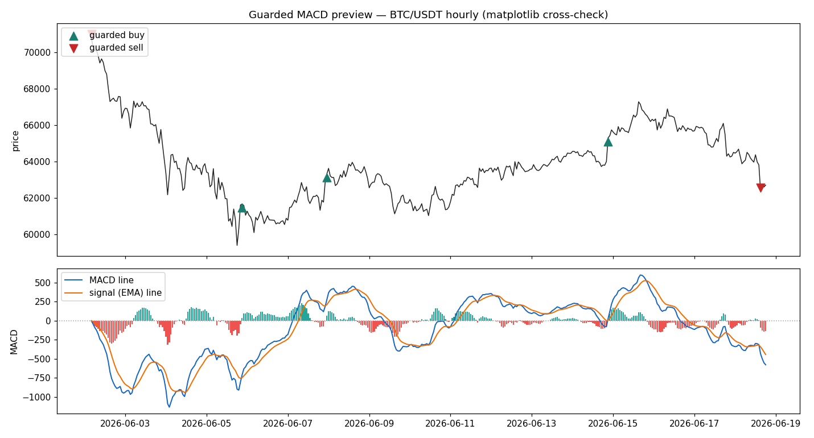
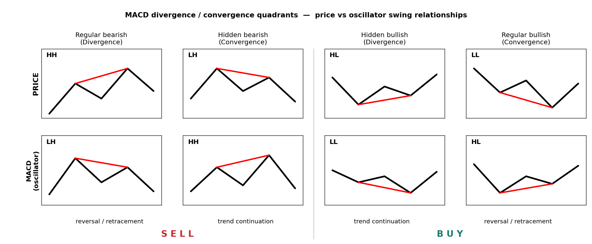
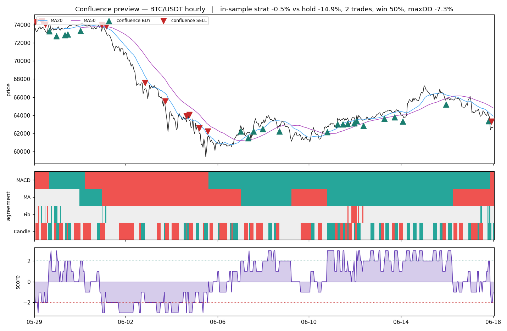

### Day Trader Metrics | Controls | tions  

A read-only crypto market scanner. It pulls live public price data, computes a
stack of technical indicators, ranks coins by a composite signal, and saves
dated reports. It does not place trades. There are no API keys and no order
routing; the live switch stays off by design.



*Guarded MACD on BTC/USDT (hourly). Green triangles mark guarded buys, red mark
guarded sells; the lower panel shows the MACD line, signal line, and histogram.*

### Table of Contents

- [Overview](#overview)
- [Environment Setup](#environment-setup)
- [Import Data](#import-data)
- [Analyze Data](#analyze-data)
- [Rank Data](#rank-data)
- [Performance Metrics](#performance-metrics)
  - [MACD Trends](#macd-trends)
  - [Divergence and Convergence Quadrants](#divergence-and-convergence-quadrants)
  - [MACD in Crypto Markets](#macd-in-crypto-markets)
  - [Corroborating Metrics](#corroborating-metrics)
- [Final Metrics](#final-metrics)
  - [Entry Points](#entry-points)
  - [Exit Points](#exit-points)
  - [Four Votes](#four-votes)
  - [2-3 Rule Thresholds](#2-3-rule-thresholds)
  - [Honest Cynicism Check](#honest-cynicism-check)
  - [Change of Heart](#change-of-heart)
- [Decision Checklist](#decision-checklist)

### Overview

The pipeline runs in four steps: pull recent candles for the most-traded USDT
pairs via CCXT, compute per-coin indicators, score each coin with the Four Votes
system against a buy/sell threshold, then rank entry and exit candidates and
write a dated CSV to `/outputs`. The whole notebook is analysis, not execution.
Interactive Plotly dashboards live alongside the static previews: the
[MACD dashboard](trader-py/outputs/macd_lab/macd-dashboard.html), the
[Fibonacci dashboard](trader-py/outputs/fib_lab/fib-dashboard.html), and the
[confluence dashboard](trader-py/outputs/confluence_lab/confluence-dashboard.html) open in
any browser.

### Environment Setup

Built for Python 3.11; the setup cell halts on any other kernel. Dependencies are
pinned in `inputs/requirements.txt` and reinstalled on each fresh kernel, so no
virtual environment is committed. The core libraries are ccxt (data),
pandas-ta-classic (indicators), pykalman (smoothing), and plotly (charts). Run
the setup cell once per session to rebuild the environment and configure graphics.
No API keys are required, since only public market data is read.

### Import Data

Live OHLCV candles are sourced from a chosen exchange. Five filters control the
scan. The universe is the top `TOP_N` spot `/USDT` pairs ranked by quote volume;
each extra symbol adds roughly a second.

| Parameter | Default | Meaning |
|-----------|---------|---------|
| `EXCHANGE` | `binance` | Source exchange (105 supported by CCXT) |
| `SANDBOX` | `False` | Testnet / fake money toggle |
| `TIMEFRAME` | `1d` | Candle size (1m … 1w) |
| `LIMIT` | `300` | Candles pulled per coin (max 1000) |
| `TOP_N` | `20` | Most-traded pairs to scan |

### Analyze Data

Each coin is scored on its latest candle against several lenses:

- **Kalman filter** smooths price noise and marks close-of-day strength.
- **Bollinger Bands (14)** show volatility; narrowing is quiet, flaring is volatile.
- **Ichimoku spans (9, 26)** map trend direction over the medium term.
- **AMAT** flags whether fast and slow averages are aligned (1 = trending).
- **RSI** gauges speed; above 70 is overbought, below 30 oversold.
- **Choppiness** separates clean trend (low) from inertia (high).
- **Candle shapes** detect doji, dragonfly, and gravestone reversal hints.
- **MACD (12, 26, 9)** tracks momentum through crossovers and histogram slope.

The base buy flag requires AMAT trending, EMA-14 above the Kalman mean, and the
low above the Kalman mean. The sell flag is the mirror.

### Rank Data

The engine runs over the universe into one table, skipping symbols too new to
have full indicator history rather than hiding them. Buy candidates are sorted by
trend strength and lowest RSI at the top; sell candidates are the mirror. The top
name is charted with its Kalman and EMA-14 lines, and the table is saved as a
dated CSV.

### Performance Metrics

#### MACD Trends

MACD (Moving Average Convergence Divergence) tracks changing momentum: the speed
of acceleration or decay in a price trend. Because the MACD line moves faster than
the slow average, the two lines cross as the 12-EMA crosses the 26-EMA. A cross
above the zero line signals a bullish turn, below signals bearish. Earlier
crossovers offer more potential than the zero line but carry more false starts.
The histogram beneath measures the gap between the lines: a growing histogram
means accelerating momentum, a shrinking one means a likely turn. Divergence,
the hardest read, compares the swing of price highs and lows against the matching
MACD swings and is used mainly to protect a position before a change rather than
to time a precise entry.

#### Divergence and Convergence Quadrants

The full taxonomy reads the last two price swings against the matching MACD
swings, using the HH / HL / LH / LL pattern rather than the labels, since
terminology is not standardised across sources.



*The four price-versus-oscillator swing relationships. The left pair resolves to
SELL, the right pair to BUY. Read the swing structure, not the label.*

A single chart can show mixed signals, so weigh both the peak and trough series
and never act on one line in isolation.

#### MACD in Crypto Markets

MACD is well respected in BTC and ETH markets but is never read alone. It pairs
with position sizing and an expected stop. A useful crypto technique draws the
trendline on the MACD itself, not only on price: in the May 2021 BTC top, price
held a rising trendline while the MACD was already tracing a falling one, and the
MACD trendline broke first. Faster timeframes update sooner (a 4h or 1h MACD
moves quicker than a daily one), but the real limiter is volatility: the more
violent the asset, the more its forecast leans on corroboration.

### Corroborating Metrics

MACD reads momentum well but signals overbought and oversold poorly, so a
crossover is confirmed against a second indicator and acted on only when both
agree. Candidate partners include the Relative Vigor Index, Money Flow Index,
TEMA, TRIX, the Awesome Oscillator, and a 20-period MA. The shared idea is the
guardrail already built into the metric: never take a bare crossover. The Money
Flow Index, with its volume gate, is the strongest candidate to add next.

## Final Metrics

The current iteration defines `cross_up` and `cross_down` crossover points, plus
`guarded_buy` and `guarded_sell` constraints that add a conservative noise band.
Histogram variables (`hist_slope`, converging flags) flag early fades near zero,
and `bear_div` / `bull_div` capture the divergence quadrants. MACD breaks and
hidden divergence are not yet coded and are the next target. Overall `strength`
is compiled from band clearances, slope spikes, the zero field, and divergence
corroboration, with the swing series weighted most heavily.

### Entry Points

Buy candidates are displayed first, with Kalman flags shown and the lowest RSI
scores at the top.

### Exit Points

Sell candidates mirror the entries: coins trending down with prices below the
Kalman mean, weakest names at the top.

### Four Votes

The composite decision is the **Four Votes** system. Each component casts +1
(buy), -1 (sell), or 0 (neutral):

- **MACD** holds a regime: a guarded crossover sets the stance and keeps it until the opposite guarded crossover flips it.
- **MA crossover** votes +1 when the 20-period SMA is above the 50, -1 below.
- **Fibonacci** is contextual: a pullback into the 0.5–0.618 golden pocket on a rising leg votes +1, a bounce into it on a falling leg votes -1, otherwise 0.
- **Candles** vote +1 on a bullish engulf, -1 on bearish, held live for a few bars.


*Fibonacci levels auto-anchored to the latest swing on BTC/USDT (hourly). The
shaded band is the 0.5–0.618 golden pocket; dotted lines mark retracement and
extension levels.*

A note on the candle vote: an earlier bug renamed a column by position and
swapped the open and close prices, so the pattern read the wrong data. This
version fixes that and uses the standard engulfing definition on the correct
columns.

### 2-3 Rule Thresholds

Votes are summed into a weighted score, and a trade fires when the score first
crosses the threshold:

```
score = w_macd*MACD + w_ma*MA + w_fib*Fib + w_candle*Candle   (weights default 1)
BUY  when score first reaches +threshold   (default +2)
SELL when score first reaches -threshold   (default -2)
```

Two-point agreement is the standard rule; the stricter three-point version is
used when a setup has fewer trades to learn from. The backtest only ever uses
information available at the time, and a second buy signal while already holding
does not open a new position, so the dashboard shows more markers than the
backtest trades.



*The confluence view: price with the 20- and 50-MA and buy/sell markers, a panel
showing where MACD, MA, Fibonacci, and Candle votes agree, and the composite
score against the +2 / -2 thresholds.*

### Honest Cynicism Check

An hourly backtest over ten coins (~41 days, 0.1% fee per side, long-flat,
threshold 2) ran through a broad crypto downtrend.

| Coin | Strategy | Buy & Hold | Trades | Win % | Max DD |
|------|----------|-----------|--------|-------|--------|
| BTC | -1.4% | -21.3% | 4 | 50 | -7.3% |
| ETH | -9.2% | -26.1% | 5 | 20 | -16.1% |
| SOL | -19.8% | -22.1% | 6 | 33 | -36.9% |
| BNB | -0.9% | -9.9% | 5 | 40 | -6.7% |
| XRP | -6.3% | -17.9% | 4 | 50 | -15.5% |
| ADA | -16.9% | -38.2% | 5 | 20 | -22.0% |
| AVAX | -8.0% | -33.6% | 6 | 33 | -16.7% |
| LINK | -19.7% | -20.3% | 7 | 29 | -25.4% |
| LTC | -10.1% | -23.4% | 4 | 25 | -17.1% |
| DOGE | -9.2% | -22.6% | 3 | 33 | -15.1% |
| **Mean** | **-10.1%** | **-23.5%** | | | |

Read plainly: the engine lost money on every coin but roughly half of what
holding lost, because staying flat through the downtrend avoided the worst of it.
That is drawdown reduction, not edge. Beating buy-and-hold by being absent during
a fall does not survive into a rising or sideways market. Win rates of 20–50%
confirm no demonstrated predictive skill yet.

### Change of Heart

The earned next step is walk-forward validation: split each coin's history into
rolling train and test segments, choose the weights and threshold on train only,
score once on the untouched test segment, and report only the out-of-sample,
after-fees aggregate across bull, bear, and sideways regimes. Add a stop and a
take-profit, since a flat-long rule with no risk control flatters drawdown. Real
money is justified only if that result clearly beats both buy-and-hold and a coin
flip; even then the operator owns the decision and the live switch stays off.

## Decision Checklist

1. Read balances (USDT, BTC, …).
2. Size each trade as cash divided by the number of long candidates.
3. Act on exits (bottom) before entries (top).
4. Widen timelines and trend comparisons (all data saved and dated in `/outputs`).

Regenerate the report in other formats from the repo root:

```
quarto render day-metrics.ipynb --to html --no-execute
quarto render day-metrics.ipynb --to docx --no-execute
quarto render day-metrics.ipynb --to pdf  --no-execute
```
