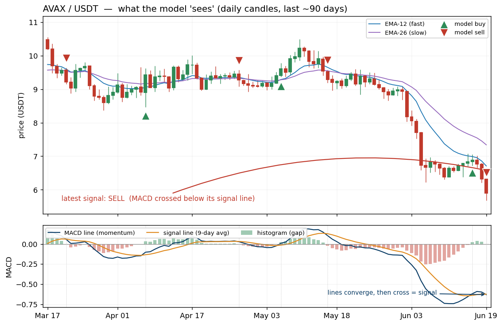
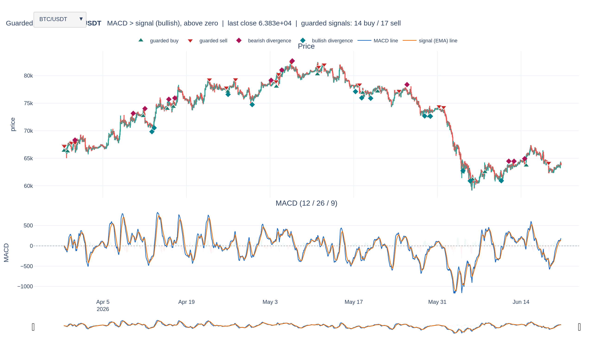
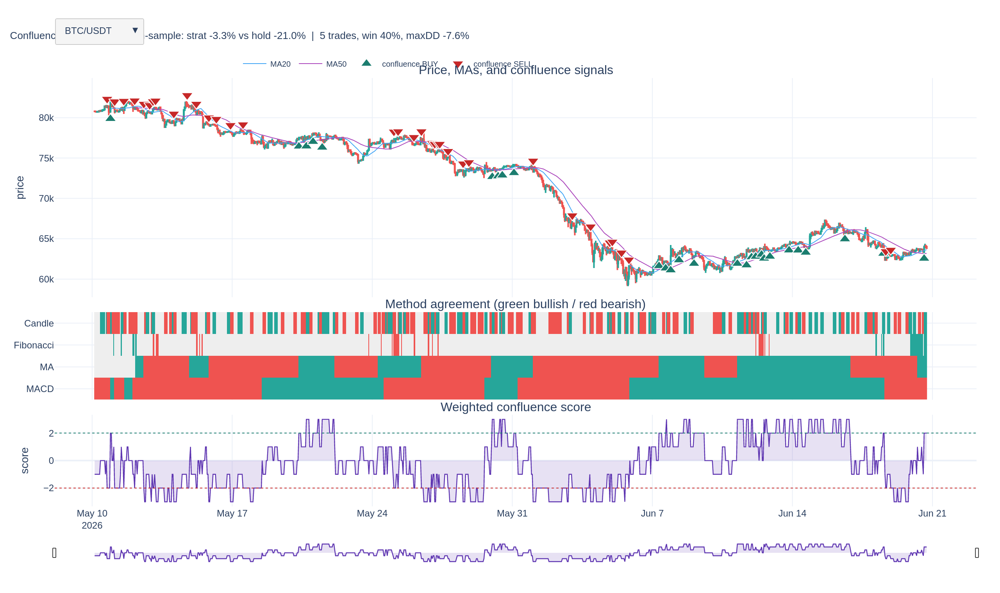
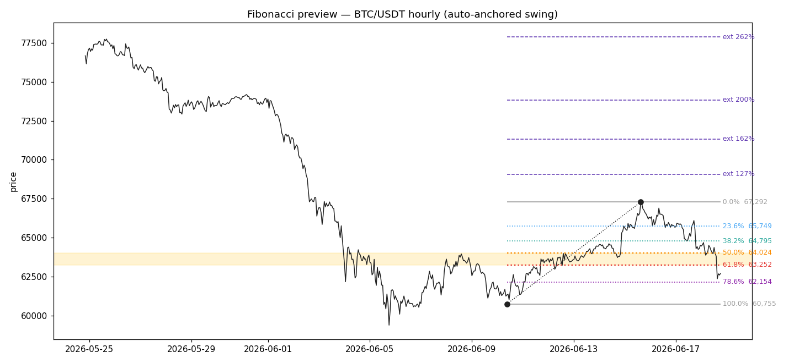
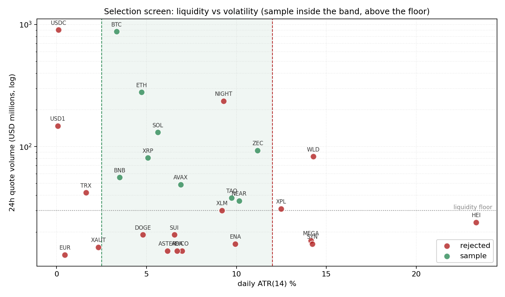
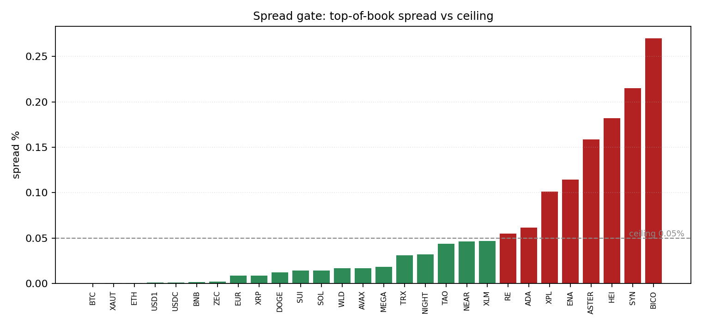

# Swing Trader 

Currently, a read-only crypto market scanner. It pulls live public price data, computes a
stack of technical indicators, ranks coins by a composite signal, and saves
dated reports. It does not place trades, the live switch stays off by design until model trained and margins are clear of strict thresholds.


*Guarded MACD on BTC/USDT (hourly). Green triangles mark guarded buys, red mark
guarded sells; the lower panel shows the MACD line, signal line, and histogram.*

## Table of Contents

- [Overview](#overview)
- [Signal Journal](#signal-journal)
- [Environment Setup](#environment-setup)
- [Import Data](#import-data)
- [Analyze Data](#analyze-data)
- [Rank Data](#rank-data)
- [Trader Metrics](#trader-metrics)
  - [MACD Trends](#macd-trends)
  - [Divergence and Convergence Quadrants](#divergence-and-convergence-quadrants)
  - [MACD in Crypto Markets](#macd-in-crypto-markets)
  - [Corroborating Metrics](#corroborating-metrics)
  - [Summary Metrics](#summary-metrics)
  - [Entry Points](#entry-points)
  - [Exit Points](#exit-points)
  - [Four Vote Scoring](#four-vote-scoring)
  - [Honest Cynicism Check](#honest-cynicism-check)
- [Trader Controls](#trader-controls)
  - [Four Gate Screening](#four-gate-screening)
  - [ATR Volatility Band](#atr-volatility-band)
  - [Position Sizing](#position-sizing)
  - [Net-edge Fee Fence](#net-edge-fee-fence)
- [Trader Execution](#trader-execution)
  - [Walkforward Test](#walkforward-test)
- [Project Status and Roadmap](#project-status-and-roadmap)
  - [Next Steps](#next-steps)
  - [Appendix: Key Concepts](#appendix-key-concepts)  
  - [Report Generation](#report-generation)

## Overview

trader-py is a research system for selective swing trading on crypto, and it is
analysis-only: it reads live public prices, decides what is worth trading and how
much, and tests whether any of it makes money after fees. It places no trades. The
live switch stays off until a configuration clears strict out-of-sample thresholds.

The work is organised into three chapters, and the rest of this README follows that
order:

- **Metrics (Chapter One)** measures the market: the indicator stack (Kalman,
  Bollinger, Ichimoku, AMAT, RSI, choppiness, MACD) and the Four Vote scoring that
  ranks coins. See Environment Setup through Final Metrics.
- **Controls (Chapter Two)** decides what is tradable and bounds the bet: the weekly
  four-gate screen, the ATR volatility band, position sizing, and the net-edge fee
  fence. See Controls.
- **Execution (Chapter Three)** proves the strategy out-of-sample and, only if it
  earns it, runs it for real: the walk-forward validation and the status. See
  Walkforward Validation and Project Status.

The honest current state is NO-GO: the strategy has no demonstrated edge yet. What
exists is the scoreboard that can prove or kill each change, one logged run at a
time. Nothing trades. The Signal Journal below is the quickest way to watch the
model reason on real candles.

## Data and Model Design (1h all-market frame, updated 2026-06-21)

The model track was rebuilt this cycle. The earlier design trained on a fixed ten coins of
daily bars; it now trains on the **full active USDT spot market** at **1-hour** resolution.
The change and its rationale:

- **Universe: ~433 pairs, not ten.** Every active USDT spot pair on Binance (from
  `exchangeInfo`), point-in-time screened so each (coin, hour) row is kept only if it would
  have passed the four-gate screen as of that bar. This matches training to the dynamic
  universe actually traded and reduces survivorship bias.
- **Interval: 1 hour.** Chosen to analyse crypto intraday while staying swing- and day-trade
  capable. Bar interval is observation resolution, not trade frequency: it is paired with a
  cost-defensible label and selective execution, so the ~0.20% round-trip cost stays small
  relative to the target.
- **History and source: longest available, exchange-grade.** Full history per coin (BTC back
  to 2017), pulled offline from the official `data.binance.vision` archives rather than a
  gappy live API, with ccxt only as a live top-up. Every coin passes a gap gate (at most 2% of
  hourly bars missing, no single gap over 72 hours) before training. See `tasks/data-standards.md`.
- **Features: a broad, scale-invariant candidate set.** Two window families (a wall-clock
  family equal to the daily windows times 24, and a shorter intraday family), an in-house
  indicator block (Williams %R, Stochastic, CCI, CMF, MFI, ADX/DMI, Aroon), the trade-flow
  imbalance from the kline taker-buy volume, and optional pandas-ta and TA-Lib layers (PPO,
  TRIX, Vortex, Fisher, Chande Kroll Stop; Parabolic SAR, MESA-MA, Ultimate Oscillator,
  Hilbert cycle features, candlestick patterns). All causal. Breadth is deliberate: a
  variable-selection pass (likelihood-ratio tests, elastic-net paths) prunes predictors before
  final fitting.
- **Label: ATR-scaled triple barrier, day-trade horizon.** A configurable +k ATR before -m ATR
  within N bars (default +2 / -1 ATR over 48 bars, two days), calibrated to each coin's own
  volatility rather than a fixed +10% / -5% / 20-day target.
- **Split: honest out-of-sample.** Hold out the final ~1 year, train on all prior history,
  embargo one label horizon at the cut, score the test set once.

**Model tuning objectives.** Every change is judged on one after-fee, out-of-sample scoreboard
(`outputs/AA-evals/evaluation-scores.md`) and kept only if it beats both buy-and-hold and a
coin-flip. The open work: Priority 1a sweeps the exit geometry (stop, take-profit, per-coin
trailing stops, a time-decaying take-profit); Priority 1b sweeps the label geometry
(`inputs/sweep_label_1h.py`); the two are settled together because they are the same
reward-to-risk question seen from the exit and label sides. The 1h dataset is built by
`inputs/build_dataset_1h.py` and scored by `inputs/train_model_1h.py`. The honest current state
remains NO-GO.

## Signal Journal

The signal journal is the fastest way to see what the model actually sees and does.
For any coin it finds every entry and exit the MACD logic produced, draws the daily
candles with the moving averages and marks each signal, then writes a table beside
the chart noting the trend, RSI, volatility, and whether the fee fence would let
that trade fire. Each coin's study sheet is a self-contained HTML page, so a visual
library builds up every time the screen runs and you can watch the model reason on
real candles rather than trust it blind.

Where to find it: the generator is the `save_journal` function in
`day-controls.ipynb`; the saved study sheets are in `outputs/AA-journal/`, one HTML
file per coin. A static example is below; open the HTML for the interactive chart
and the full table of actions.



*Signal journal for BTC/USDT: candles with model entries (green) and exits (red) on
top, MACD beneath. The HTML version adds a row-by-row table logging each signal's
trend, RSI, volatility, and whether the fee fence would have allowed the trade.*

## Environment Setup

Dependencies are pinned in `inputs/requirements.txt` and reinstalled on each fresh kernel,
`venv` also committed. The core libraries are `ccxt` (data), `pandas-ta` (indicators), `pykalman` (smoothing), and `plotly` (charts). Run the setup cell once per session to rebuild the environment and configure graphics.

## Import Data

Live OHLCV candles are sourced from a chosen exchange. Five filters control the
scan. The initial selection is the top `TOP_N` spot `/USDT` pairs ranked by quote volume;
each extra symbol adds roughly a second.

| Parameter | Default | Meaning |
|-----------|---------|---------|
| `EXCHANGE` | `binance` | Source exchange (105 supported by CCXT) |
| `SANDBOX` | `False` | Testnet / fake money toggle |
| `TIMEFRAME` | `1d` | Candle size (1m … 1w) |
| `LIMIT` | `300` | Candles pulled per coin (max 1000) |
| `TOP_N` | `20` | Most-traded pairs to scan |

## Analyze Data

Each coin is scored on its latest candle against several lenses:

- **Kalman filter** smooths price noise and marks close-of-day strength.
- **Bollinger Bands (14)** show volatility; narrowing is quiet, flaring is volatile.
- **Ichimoku spans (9, 26)** map trend direction over the medium term.
- **AMAT** flags whether fast and slow averages are aligned (1 = trending).
- **RSI** gauges speed; above 70 is overbought, below 30 oversold.
- **Choppiness** separates clean trend (low) from inertia (high).
- **Candle shapes** detect doji, dragonfly, and gravestone reversal hints.
- **MACD (12, 26, 9)** tracks momentum through crossovers and histogram slope.

The base buy flag requires AMAT trending, EMA-14 above the Kalman mean, and the
low above the Kalman mean. The sell flag is the mirror.

## Rank Data

In this initial signal layer of chapter 1, the engine scans the market reference of the most
liquid USDT spot pairs, computes the indicator stack for each, and draws the results
into one table, skipping symbols too new to have full indicator history rather than
hiding them. Buys are sorted to the top by the buy flag and then by lowest RSI or most
oversold first. In this ranking, sells are the mirror below, ranked by the sell flag and highest RSI. The top name is charted with its Kalman and EMA-14 lines, and the table is saved as a dated CSV
(`outputs/CSV/DailySignals_<date>.csv`). This ranking is upstream of
and separate from the Chapter Two market screening and from the Chapter Three model tuning. The table below is an illustration over the fixed ten-coin working set, the long-history large-cap coins the model trains on (listed in `inputs/build_dataset.py`), not the output of the live market scan. The scan that actually scopes the wider market down to a tradable sample is the four-gate screen shown under Controls below. This snapshot is from 2026-06-20, a broadly down day where no coin cleared the buy gate, so all ten read as sells, ranked by RSI.

| Coin | Close    | RSI  | Chop | AMAT | EMA>Kalman | Low>Kalman | Signal |
|------|---------:|-----:|-----:|:----:|:----------:|:----------:|:------:|
| SOL  | 69.74    | 42.3 | 46.9 | no   | no         | no         | sell   |
| LINK | 7.95     | 40.5 | 47.6 | no   | no         | no         | sell   |
| XRP  | 1.1359   | 39.3 | 45.4 | no   | no         | no         | sell   |
| BNB  | 581.42   | 38.7 | 51.5 | no   | no         | no         | sell   |
| ETH  | 1711.19  | 38.6 | 45.1 | no   | no         | no         | sell   |
| LTC  | 44.07    | 37.7 | 56.0 | no   | no         | no         | sell   |
| BTC  | 63543.91 | 37.4 | 50.6 | no   | no         | no         | sell   |
| DOGE | 0.0836   | 33.7 | 50.4 | no   | no         | no         | sell   |
| ADA  | 0.1621   | 30.9 | 49.3 | no   | no         | no         | sell   |
| AVAX | 5.896    | 22.3 | 53.2 | no   | no         | no         | sell   |

When any coin clears the buy gate it floats to the top, lowest RSI first.

## Trader Metrics

Three interactive dashboards visualise the indicator stack; static snapshots are
embedded below, and the interactive HTML in `outputs/HTML/` opens in any browser.



*MACD dashboard, BTC/USDT default view: price candles with guarded buy/sell
triangles and divergence diamonds, the MACD line, signal line, and histogram.*


*Fibonacci dashboard, BTC/USDT: retracement and extension levels auto-anchored to
the latest swing, with the golden pocket shaded.*



*Confluence dashboard, BTC/USDT: price with the 20- and 50-MA and buy/sell markers,
the method-agreement panel, and the weighted score against the thresholds.*

### MACD Trends

MACD (Moving Average Convergence Divergence) tracks changing momentum: the speed
of acceleration or decay in a price trend. Because the MACD line moves faster than
the slow average, the two lines cross as the 12-EMA crosses the 26-EMA. A cross
above the zero line signals a bullish turn, below signals bearish. Earlier
crossovers offer more potential than the zero line but carry more false starts.
The histogram beneath measures the gap between the lines: a growing histogram
means accelerating momentum, a shrinking one means a likely turn. Divergence,
the hardest read, compares the swing of price highs and lows against the matching
MACD swings and is used mainly to protect a position before a change rather than
to time a precise entry.

### Divergence and Convergence Quadrants

The full taxonomy reads the last two price swings against the matching MACD
swings, using the HH / HL / LH / LL pattern rather than the labels, since
terminology is not standardised across sources.


*The four price-versus-oscillator swing relationships. The left pair resolves to
SELL, the right pair to BUY. Read the swing structure, not the label.*

A single chart can show mixed signals, so weigh both the peak and trough series
and never act on one line in isolation.

### MACD in Crypto Markets

MACD is well respected in BTC and ETH markets but is never read alone. It pairs
with position sizing and an expected stop. A useful crypto technique draws the
trendline on the MACD itself, not only on price: in the May 2021 BTC top, price
held a rising trendline while the MACD was already tracing a falling one, and the
MACD trendline broke first. Faster timeframes update sooner (a 4h or 1h MACD
moves quicker than a daily one), but the real limiter is volatility: the more
violent the asset, the more its forecast leans on corroboration.

### Corroborating Metrics

MACD reads momentum well but signals overbought and oversold poorly, so a
crossover is confirmed against a second indicator and acted on only when both
agree. Candidate partners include the Relative Vigor Index, Money Flow Index,
TEMA, TRIX, the Awesome Oscillator, and a 20-period MA. The shared idea is the
guardrail already built into the metric: never take a bare crossover. The Money
Flow Index, with its volume gate, is the strongest candidate to add next.

### Summary Metrics

The current iteration defines `cross_up` and `cross_down` crossover points, plus
`guarded_buy` and `guarded_sell` constraints that add a conservative noise band.
Histogram variables (`hist_slope`, converging flags) flag early fades near zero,
and `bear_div` / `bull_div` capture the divergence quadrants. MACD breaks and
hidden divergence are not yet coded and are the next target. Overall `strength`
is compiled from band clearances, slope spikes, the zero field, and divergence
corroboration, with the swing series weighted most heavily.

### Entry Points

Buy candidates are displayed first, with Kalman flags shown and the lowest RSI
scores at the top.

A live daily scan (snapshot 2026-06-20) ranks the ten-coin sample, most oversold
first. On this date a broad downtrend left no coin clearing all three buy gates
(AMAT trending, EMA-14 above the Kalman mean, the low above the Kalman mean), so
these are the oversold names to watch, not confirmed buys. The patient strategy
sits out when nothing qualifies.

| Coin | Close | RSI | Chop | AMAT | EMA>Kalman | Low>Kalman |
|---|---|---|---|---|---|---|
| AVAX | 5.896 | 22.3 | 53.2 | no | no | no |
| ADA | 0.1621 | 30.9 | 49.3 | no | no | no |
| DOGE | 0.0836 | 33.7 | 50.4 | no | no | no |
| BTC | 63543.9 | 37.4 | 50.6 | no | no | no |
| LTC | 44.07 | 37.7 | 56.0 | no | no | no |

### Exit Points

Sell candidates mirror the entries: coins trending down with prices below the
Kalman mean, weakest names at the top.

In the same scan all ten coins flagged as sell candidates (price below the Kalman
mean, the fast average below it, AMAT not trending), ranked by RSI. A downtrend
that puts the whole sample on the sell side is exactly when the engine stays
flat, which is the drawdown-reduction behaviour the cynicism check measured.

| Coin | Close | RSI | Chop | AMAT | EMA>Kalman | Low>Kalman |
|---|---|---|---|---|---|---|
| SOL | 69.74 | 42.3 | 46.9 | no | no | no |
| LINK | 7.95 | 40.5 | 47.6 | no | no | no |
| XRP | 1.1359 | 39.3 | 45.4 | no | no | no |
| BNB | 581.42 | 38.7 | 51.5 | no | no | no |
| ETH | 1711.19 | 38.6 | 45.1 | no | no | no |
| LTC | 44.07 | 37.7 | 56.0 | no | no | no |
| BTC | 63543.9 | 37.4 | 50.6 | no | no | no |
| DOGE | 0.0836 | 33.7 | 50.4 | no | no | no |
| ADA | 0.1621 | 30.9 | 49.3 | no | no | no |
| AVAX | 5.896 | 22.3 | 53.2 | no | no | no |

Each scan is saved as a dated CSV in `outputs/` (latest: `outputs/DailySignals_latest.csv`).

### Four Vote Scoring

The composite decision is the **Four Votes** system. Each component casts +1
(buy), -1 (sell), or 0 (neutral):

- **MACD** holds a regime: a guarded crossover sets the stance and keeps it until the opposite guarded crossover flips it.
- **MA crossover** votes +1 when the 20-period SMA is above the 50, -1 below.
- **Fibonacci** is contextual: a pullback into the 0.5–0.618 golden pocket on a rising leg votes +1, a bounce into it on a falling leg votes -1, otherwise 0.
- **Candles** vote +1 on a bullish engulf, -1 on bearish, held live for a few bars.

The four votes are summed into a weighted score, and a trade fires when the score
first crosses the threshold:

```
score = w_macd*MACD + w_ma*MA + w_fib*Fib + w_candle*Candle   (weights default 1)
BUY  when score first reaches +threshold   (default +2)
SELL when score first reaches -threshold   (default -2)
```

Two-point agreement is the standard rule; the stricter three-point version is used
when a setup has fewer trades to learn from. The score is a net total rather than a
head-count: a +2 can be two buy votes and no sells, or three buys against one sell.



*Fibonacci levels auto-anchored to the latest swing on BTC/USDT (hourly). The
shaded band is the 0.5–0.618 golden pocket; dotted lines mark retracement and
extension levels.*


*The confluence view: price with the 20- and 50-MA and buy/sell markers, a panel
showing where MACD, MA, Fibonacci, and Candle votes agree, and the composite
score against the +2 / -2 thresholds.*

A note on the candle vote: an earlier bug renamed a column by position and
swapped the open and close prices, so the pattern read the wrong data. This
version fixes that and uses the standard engulfing definition on the correct
columns.

### Honest Cynicism Check

An hourly backtest over ten coins (~41 days, 0.1% fee per side, long-flat,
threshold 2) ran through a broad crypto downtrend.

| Coin | Strategy | Buy & Hold | Trades | Win % | Max DD |
|------|----------|-----------|--------|-------|--------|
| BTC | -1.4% | -21.3% | 4 | 50 | -7.3% |
| ETH | -9.2% | -26.1% | 5 | 20 | -16.1% |
| SOL | -19.8% | -22.1% | 6 | 33 | -36.9% |
| BNB | -0.9% | -9.9% | 5 | 40 | -6.7% |
| XRP | -6.3% | -17.9% | 4 | 50 | -15.5% |
| ADA | -16.9% | -38.2% | 5 | 20 | -22.0% |
| AVAX | -8.0% | -33.6% | 6 | 33 | -16.7% |
| LINK | -19.7% | -20.3% | 7 | 29 | -25.4% |
| LTC | -10.1% | -23.4% | 4 | 25 | -17.1% |
| DOGE | -9.2% | -22.6% | 3 | 33 | -15.1% |
| **Mean** | **-10.1%** | **-23.5%** | | | |

Read plainly: the engine lost money on every coin but roughly half of what
holding lost, because staying flat through the downtrend avoided the worst of it.
That is drawdown reduction, not edge. Beating buy-and-hold by being absent during
a fall does not survive into a rising or sideways market. Win rates of 20–50%
confirm no demonstrated predictive skill yet.

Two notes on method, true of every backtest here: it only ever uses information
available at the time, with no peeking ahead, and a second buy signal while a
position is already open does not start a new trade, which is why the dashboards
show more markers than the backtest actually trades.

## Trader Controls

Chapter Two is the governance layer: it decides which coins are tradable and how
large each bet may be, wrapping the Chapter One signal so the model proposes and the
operator-owned fences dispose. The functions live in `day-controls.ipynb`, and four
computational controls do the work.

### Four Gate Screening

A weekly four-gate screen scopes the tradable market before the model sees a coin.
Each candidate must clear four gates: liquidity (24-hour quote volume), the ATR band
(lively enough, not detonating), spread (tight enough that the fee is the binding
cost), and history (enough candles to have lived through several regimes). The
survivors are a dated candidate table; the rule is scan wide, hold few.




*The four-gate screen on a live Binance slice: green names clear liquidity, the ATR
band, spread, and history; the rest are rejected with the reason recorded.*

The screen ranks the most-traded USDT spot pairs by 24-hour quote volume (the top 25 to
30), then applies the four gates. The live run of 2026-06-20 scanned 28 pairs; 9 cleared
all four gates and become the initial target sample to analyse more deeply, and the next
step narrows that sample to the three or four strongest as held positions. The full scan,
with each coin's metrics and the gate any rejected coin failed, is below (saved as
`outputs/CSV/2A-sample_20260620.csv`). This is the actual screen output, not a hand-picked
list: the passing names change with the market, which is why ZEC, TAO, and NEAR clear here
while DOGE, ADA, and LINK do not.

| Coin | 24h Vol $M | ATR % | Spread | Candles | Liq (>=$30M) | ATR (2.5-12%) | Spread (<=0.05) | History (>=120) | Result |
|---|---:|---:|---:|---:|:--:|:--:|:--:|:--:|---|
| BTC | 875.0 | 3.33 | 0.0 | 179 | yes | yes | yes | yes | **sample** |
| ETH | 279.0 | 4.72 | 0.0006 | 179 | yes | yes | yes | yes | **sample** |
| SOL | 131.0 | 5.63 | 0.0143 | 179 | yes | yes | yes | yes | **sample** |
| ZEC | 93.0 | 11.18 | 0.0021 | 179 | yes | yes | yes | yes | **sample** |
| XRP | 81.0 | 5.08 | 0.0088 | 179 | yes | yes | yes | yes | **sample** |
| BNB | 56.0 | 3.5 | 0.0017 | 179 | yes | yes | yes | yes | **sample** |
| AVAX | 49.0 | 6.9 | 0.0168 | 179 | yes | yes | yes | yes | **sample** |
| TAO | 38.0 | 9.74 | 0.0438 | 179 | yes | yes | yes | yes | **sample** |
| NEAR | 36.0 | 10.15 | 0.0461 | 179 | yes | yes | yes | yes | **sample** |
| USDC | 902.0 | 0.11 | 0.001 | 179 | yes | no | yes | yes | reject (atr_band) |
| NIGHT | 236.0 | 9.29 | 0.0322 | 101 | yes | yes | yes | no | reject (history) |
| RE | 184.0 | n/a | 0.0549 | 2 | yes | no | no | no | reject (atr_band,spread,history) |
| USD1 | 148.0 | 0.07 | 0.001 | 179 | yes | no | yes | yes | reject (atr_band) |
| WLD | 83.0 | 14.27 | 0.0165 | 179 | yes | no | yes | yes | reject (atr_band) |
| TRX | 42.0 | 1.63 | 0.031 | 179 | yes | no | yes | yes | reject (atr_band) |
| XPL | 31.0 | 12.49 | 0.1011 | 179 | yes | no | no | yes | reject (atr_band,spread) |
| XLM | 30.0 | 9.19 | 0.0468 | 179 | no | yes | yes | yes | reject (liquidity) |
| HEI | 24.0 | 23.33 | 0.1821 | 179 | no | no | no | yes | reject (liquidity,atr_band,spread) |
| DOGE | 19.0 | 4.79 | 0.012 | 179 | no | yes | yes | yes | reject (liquidity) |
| SUI | 19.0 | 6.55 | 0.014 | 179 | no | yes | yes | yes | reject (liquidity) |
| MEGA | 17.0 | 14.15 | 0.0184 | 51 | no | no | yes | no | reject (liquidity,atr_band,history) |
| SYN | 16.0 | 14.23 | 0.215 | 179 | no | no | no | yes | reject (liquidity,atr_band,spread) |
| ENA | 16.0 | 9.94 | 0.1142 | 179 | no | yes | no | yes | reject (liquidity,spread) |
| XAUT | 15.0 | 2.32 | 0.0002 | 86 | no | no | yes | no | reject (liquidity,atr_band,history) |
| BICO | 14.0 | 6.98 | 0.2699 | 179 | no | yes | no | yes | reject (liquidity,spread) |
| ASTER | 14.0 | 6.17 | 0.1586 | 179 | no | yes | no | yes | reject (liquidity,spread) |
| ADA | 14.0 | 6.71 | 0.0616 | 179 | no | yes | no | yes | reject (liquidity,spread) |
| EUR | 13.0 | 0.46 | 0.0087 | 179 | no | no | yes | yes | reject (liquidity,atr_band) |

Gate thresholds, from the screen config: liquidity is 24-hour quote volume at or above
$30M; the ATR band is 2.5 to 12 percent; spread is at or below 0.05; history is at least
120 daily candles. Scan wide, hold few.

### ATR Volatility Band

ATR(14) read as a percent of price, doing two jobs with one metric: a selection
filter that admits or rejects a coin from the sample, and a live guardrail that
keeps the model out of a coin that has drifted out of the tradable band. The floor
sits above the net-edge requirement; the ceiling sits below where a coin gaps through
its stops.

### Position Sizing

Each position is sized so the dollar risk is roughly constant across coins: a calmer
coin earns a larger clip, a livelier one a smaller clip, capped at a fraction of the
account and floored at the venue minimum. At a small account this favours a few
larger positions over many tiny ones that waste edge on fees.

### Net-edge Fee Fence

A trade is refused unless its expected move, after the round-trip fee and slippage,
clears a minimum-edge floor. It is a fence, not an alarm: it refuses rather than
warns, and it is measured on net, not gross. Together with the trades-per-day cap and
the out-of-sample validation of Chapter Three, it forms the three stacked defences
that make volume-hiding, burying thin losing trades in churn, impossible by
construction.

## Trader Execution

### Walkforward Test

Walk-forward validation is the gate before any live trading: split each coin's
history into rolling train and test segments, choose the weights and threshold on
train only, score once on the untouched test segment, and report only the
out-of-sample, after-fees aggregate across bull, bear, and sideways regimes, with a
stop and a take-profit added since a flat-long rule with no risk control flatters
drawdown. Real money is justified only if that result clearly beats both buy-and-hold
and a coin flip; even then the operator owns the decision and the live switch stays
off. It is now built, and its first verdict is below.

## Project Status and Roadmap

As of 2026-06-21, the model track moved to the 1-hour, full-market frame described under
"Data and Model Design" above. The figures in this section describe the prior daily ten-coin
frame and are kept as the baseline the new frame must beat; the first full 1h result is logged
to `outputs/AA-evals/evaluation-scores.md` by `inputs/train_model_1h.py`.

Chapter One (this scanner, `01-trader-metrics`) established the signal stack and the
honest cynicism check above. Chapter Two (`day-controls`) added the controls
layer: a weekly four-gate screen (liquidity, ATR band, spread, history),
ATR-scaled position sizing, a net-edge fee fence, and a per-coin signal journal.
Chapter Three began the validation the Change of Heart called for.

Priority 0, the scoreboard, is now built and run. The trade-exit simulator and
the walk-forward backtest live in `inputs/walkforward.py` (run
`python inputs/walkforward.py`; about 16 seconds, deterministic on rerun). It
writes `outputs/experiment_log.csv`, `outputs/walkforward_trades.csv`, and
`outputs/walkforward_results.md`.

Current verdict: NO-GO. Across 766 out-of-sample trades on the ten coins,
expectancy is about plus 0.03 percent per trade with a 74 percent win rate, but
the ATR stop-losses average minus 8.5 percent and cancel the frequent plus 2.8
percent take-profits. The signal beats a coin-flip by a hair and does not beat
buy-and-hold. This matches the Chapter One result (classifier AUC about 0.51, no
demonstrated skill). The value is that the scoreboard now exists, so every change
can be measured out-of-sample and after fees, one logged row at a time.

Baseline the scoreboard tested: entry is the MACD signal-line cross-up gated to
the ATR band 2.5 to 12 percent; exits are an ATR stop at 1.5 times daily ATR, a 3
percent take-profit, and a 10-day time stop, with the stop checked before the
target; train 365 days, test 90 days, 20-day embargo, signal and exits frozen so
the test window is scored once.

### Next Steps

The current plan lives in `tasks/session-handover-2026-06-21.md` and
`tasks/build-decisions-2026-06-21.md`:

- Priority 1, settle the geometry on the 1h frame: 1a sweeps the exit geometry (stop,
  take-profit, per-coin trailing stops, a time-decaying take-profit) via `inputs/walkforward.py`;
  1b sweeps the ATR-scaled label geometry via `inputs/sweep_label_1h.py`. The diagnosed leak is
  a lopsided reward-to-risk that sits on its own breakeven win rate; fix it from both sides.
- Priority 2, select then sharpen the variables: a formal variable-selection pass
  (likelihood-ratio tests, elastic-net regularization paths) over the broad candidate set, then
  the regime, Bitcoin-context, and multi-timeframe features that survive it.
- Priority 3, only after the core clears the bar: per-coin models, the optional intraday
  trade-flow detail, paper trading, then a tiny live allocation.

No live trading anywhere. The safety switch stays off until a configuration
clearly beats buy-and-hold and a coin-flip, out-of-sample and after fees margins.

### Appendix Key Concepts

#### How we test it fairly

We give the strategy a year of history to settle into, then test it on the next
three months it has never seen, then slide the window forward and repeat through
every kind of market. The 20-day gap between the learning period and the test
period is a quarantine: because a single trade can last up to twenty days, without
that gap a trade begun during training could spill into the test window and leak
information, so the two are walled off. The signal and exits are frozen and the
test window is scored once, so there is no fiddling until the number looks good.

#### The entry rule, in plain terms

The buy trigger is the moment the MACD line crosses above its signal line, the
green triangles on the dashboards above, which is the model's way of saying
momentum just turned upward. Gating to the ATR band puts a doorman in front of
that trigger: the coin is only allowed through if its typical daily move sits
between 2.5 and 12 percent. Below 2.5 it is too sleepy to ever reach a profit;
above 12 it is too wild and will blow through the exits. So the rule is, buy on
the upward cross, but only on coins lively enough to be worth it and not so
violent they are uncontrollable.

#### The exit rules, in plain terms

Three exits, whichever happens first. The stop-loss is the safety hatch, set at
1.5 times the coin's normal daily move below the entry; if price falls that far,
the loss is cut. On a coin that swings about 6 percent a day, that stop sits
roughly 9 percent down, which is exactly why the losers are so large and exactly
the thing Priority 1 will attack. The take-profit is the reward hatch: if price
rises 3 percent above the entry, the position is sold and banked. The time stop is
the patience limit: if neither hatch is reached within ten days, the trade is
closed anyway and the money freed, because a trade that has not worked in ten days
is dead weight. Stop checked before the target means that on a day wild enough to
have touched both levels, we pessimistically assume the loss happened, so the
results are never flattered.

### Report Generation

```
quarto render day-metrics.ipynb --to html --no-execute
quarto render day-metrics.ipynb --to docx --no-execute
quarto render day-metrics.ipynb --to pdf  --no-execute
```
