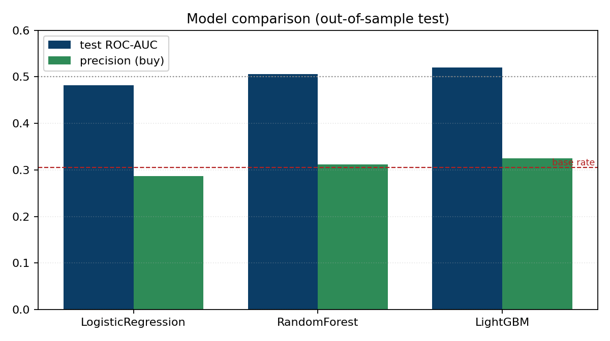
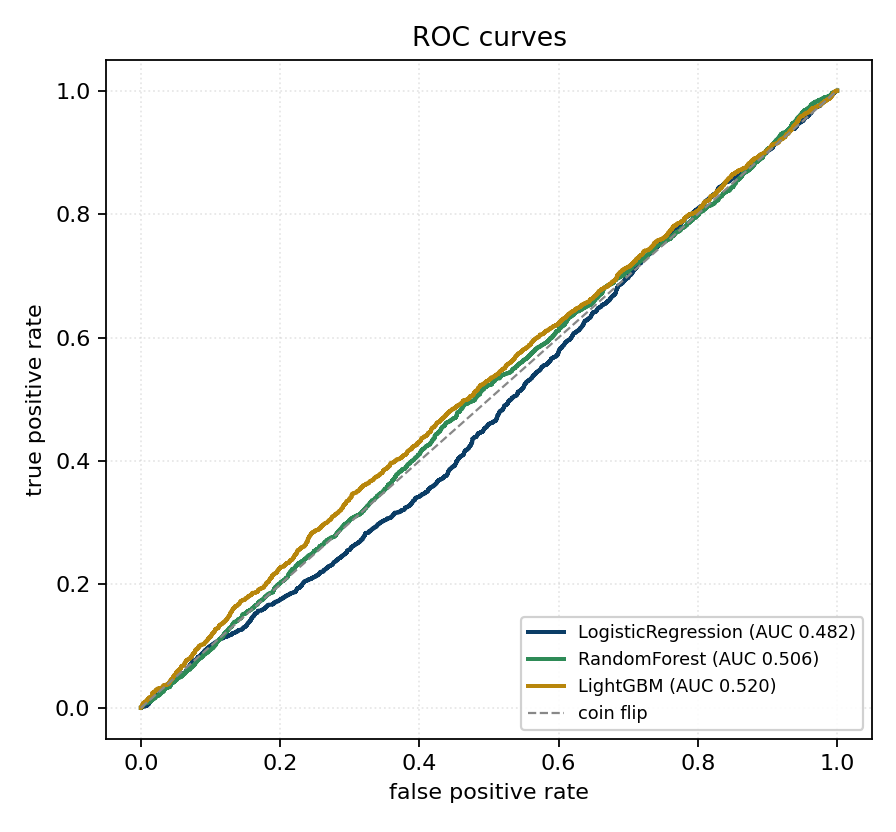
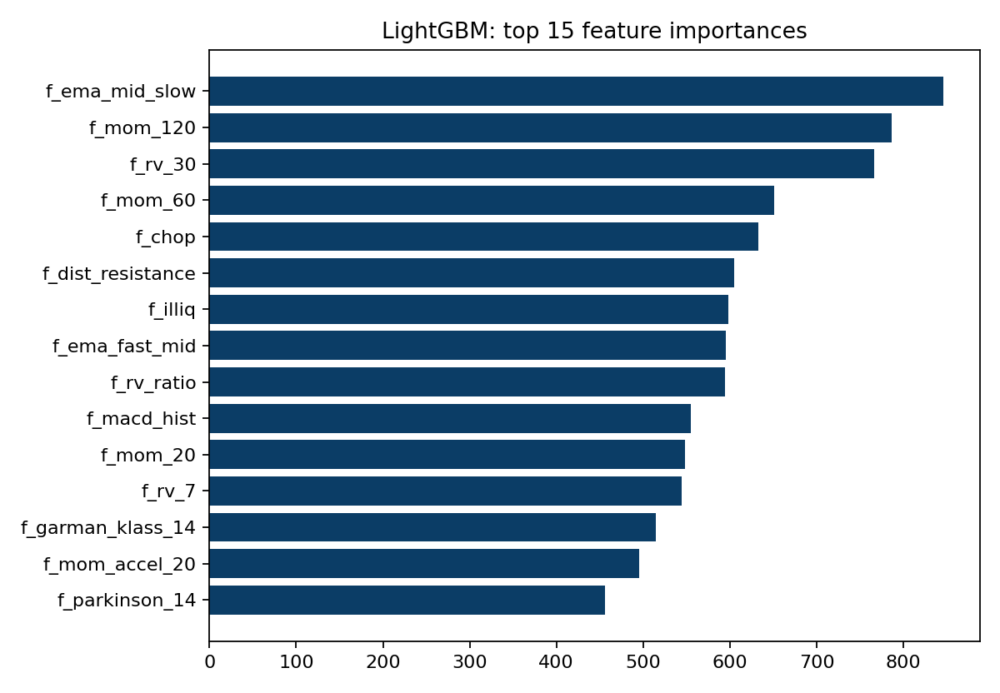
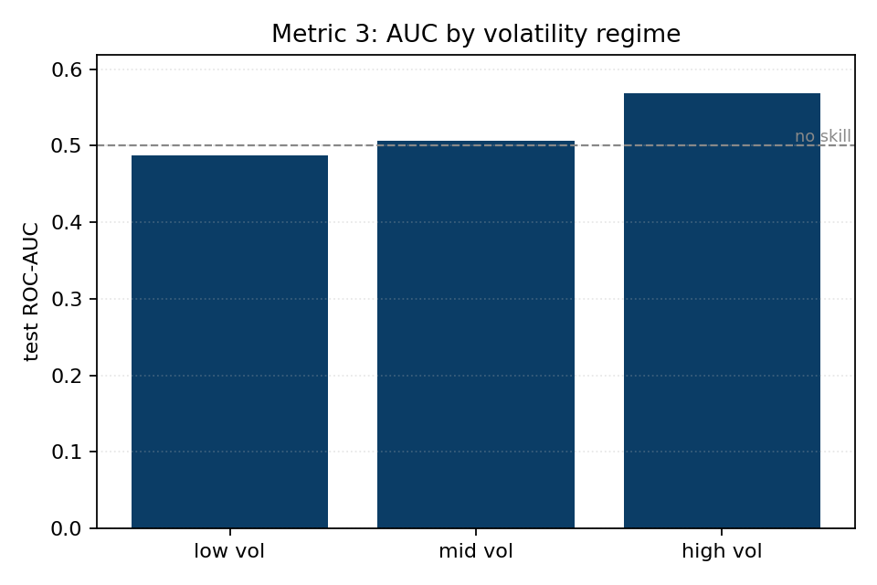

# Head-to-head model comparison (2026-06-20)

**Verdict: NO-GO** - best model **LightGBM**, test AUC 0.520, precision 0.325 vs base rate 0.305 (lift 1.07x).

## Dataset and split

| field | value |
| --- | --- |
| rows | 26,762 |
| features | 32 |
| train rows | 18,542 |
| test rows | 7,820 |
| split date | 2024-03-19 |
| embargo (days) | 20 |
| base rate (label=1) | 0.305 |
| confidence band | 0.4 - 0.6 |

## Models, out-of-sample test

Precision is TP/(TP+FP) at the 0.5 threshold; lift is precision / base rate.

| model | CV AUC | test AUC | precision | recall | accuracy | lift (x) |
| --- | --- | --- | --- | --- | --- | --- |
| LogisticRegression | 0.541 | 0.482 | 0.287 | 0.468 | 0.483 | 0.94x |
| RandomForest | 0.552 | 0.506 | 0.312 | 0.429 | 0.537 | 1.02x |
| LightGBM | 0.534 | 0.520 | 0.325 | 0.391 | 0.567 | 1.07x |

## Metric 1: confidence filter (act if p >= hi or p <= lo)

Keller's rule: score only the high-conviction rows we would actually trade. Read precision against the base rate (0.305).

| model | coverage | precision | recall | F1 |
| --- | --- | --- | --- | --- |
| LogisticRegression | 9% | 0.297 | 0.754 | 0.426 |
| RandomForest | 16% | 0.284 | 0.398 | 0.331 |
| LightGBM | 58% | 0.331 | 0.328 | 0.330 |

## Metric 3: regime-stratified performance

AUC of the best model within low / mid / high volatility terciles (by 30-day realized volatility). A model that only works in one regime is fragile.

| regime | rows | base rate | test AUC |
| --- | --- | --- | --- |
| low vol | 2,607 | 0.303 | 0.487 |
| mid vol | 2,606 | 0.312 | 0.507 |
| high vol | 2,607 | 0.301 | 0.569 |

## Metric 2: simulated P&L

Not yet wired for the model: it needs the model's signals routed through the exit-and-cost simulator in `inputs/walkforward.py`. Tracked as the next step.

## Charts

**Model comparison**

**ROC curves**

**LightGBM feature importance**

**Metric 3: AUC by volatility regime**

