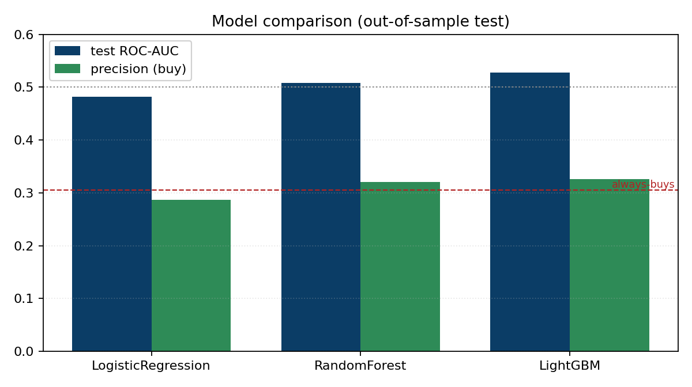
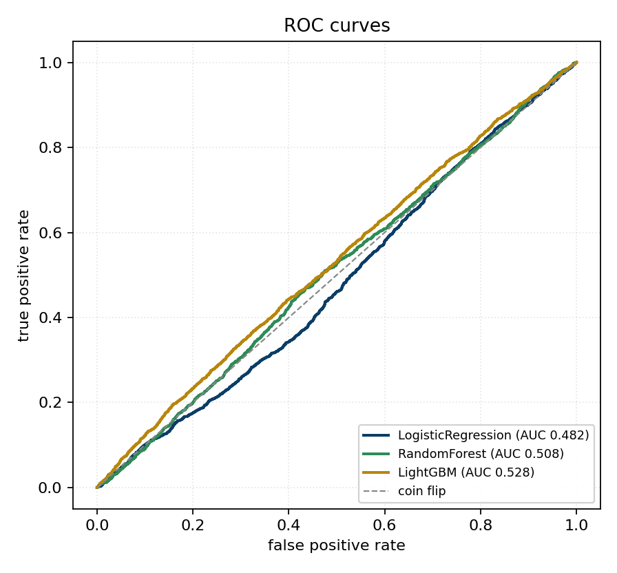
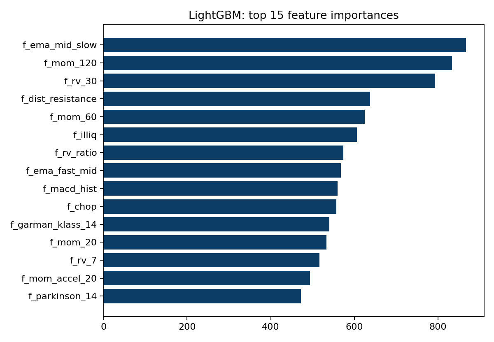
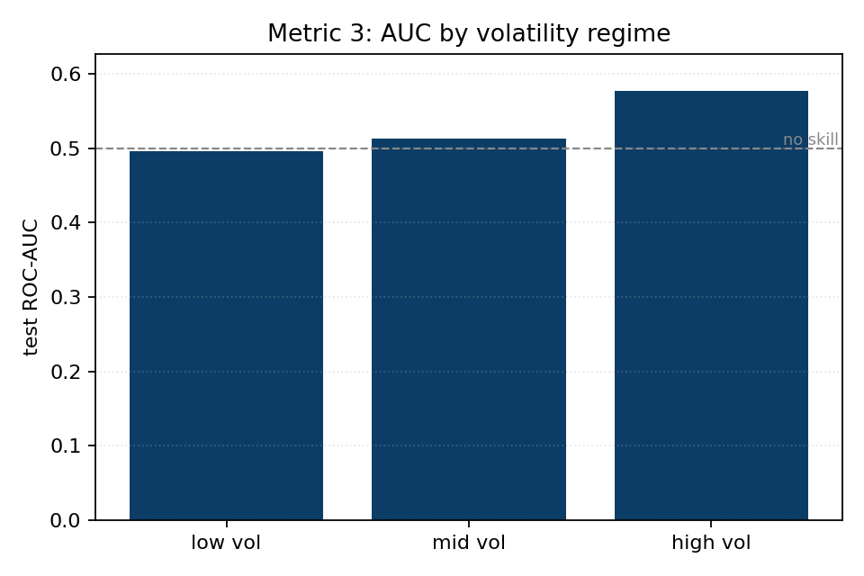
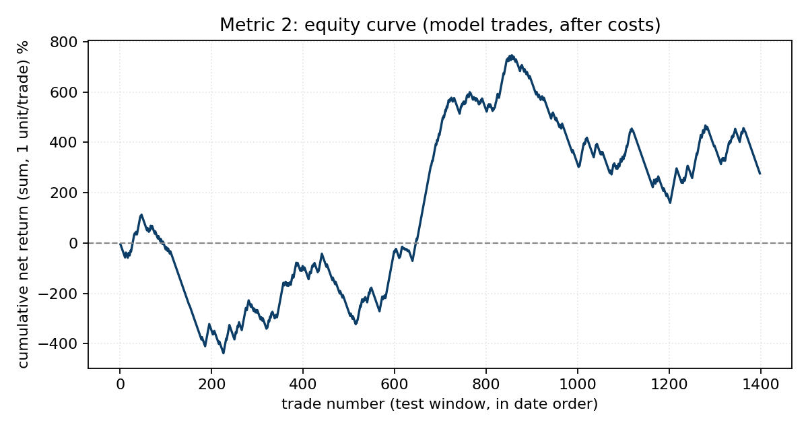

# Head-to-head model comparison (2026-06-21)

**Verdict: NO-GO** - best model **LightGBM**, test AUC 0.528, best-model precision 0.326 vs always-buys 0.305 (precision change +7.0%).

## Dataset and split

| field | value |
| --- | --- |
| rows | 26,772 |
| features | 32 |
| train rows | 18,542 |
| test rows | 7,830 |
| split date | 2024-03-19 |
| embargo (days) | 20 |
| always-buys precision (base rate) | 0.305 |
| confidence band | 0.4 - 0.6 |

## Models, out-of-sample test

Precision is TP/(TP+FP) at the 0.5 threshold; Precision Change (%) is (precision / always-buys - 1) x 100.

| model | CV AUC | test AUC | precision | recall | accuracy | Precision Change (%) |
| --- | --- | --- | --- | --- | --- | --- |
| LogisticRegression | 0.541 | 0.482 | 0.287 | 0.468 | 0.483 | -5.8% |
| RandomForest | 0.551 | 0.508 | 0.321 | 0.446 | 0.543 | +5.2% |
| LightGBM | 0.535 | 0.528 | 0.326 | 0.397 | 0.566 | +7.0% |

## Metric 1: confidence filter (act if p >= hi or p <= lo)

Keller's rule: score only the high-conviction rows we would actually trade. Read precision against always-buys precision (0.305).

| model | coverage | precision | recall | F1 |
| --- | --- | --- | --- | --- |
| LogisticRegression | 9% | 0.296 | 0.754 | 0.425 |
| RandomForest | 16% | 0.275 | 0.395 | 0.324 |
| LightGBM | 58% | 0.344 | 0.347 | 0.346 |

## Metric 3: regime-stratified performance

AUC of the best model within low / mid / high volatility terciles (by 30-day realized volatility). A model that only works in one regime is fragile.

| regime | rows | base rate | test AUC |
| --- | --- | --- | --- |
| low vol | 2,610 | 0.302 | 0.496 |
| mid vol | 2,610 | 0.311 | 0.513 |
| high vol | 2,610 | 0.301 | 0.577 |

## Metric 2: simulated P&L (after costs)

Trades = test days where the model's probability clears 0.60, each held under the +10% / -5% / 20-day triple barrier, minus a 0.20% round-trip cost (Binance.com spot with BNB, plus slippage). Equal-weight, independent trades; position sizing and overlap are the Chapter Two controls' job, not modelled here. The per-trade Sharpe and t-stat say whether the expectancy is signal or noise: |t| above about 2 is the rough bar for significance. The equity curve is the cumulative sum of net trade returns at one unit per trade, not a sized portfolio.

| metric | value |
| --- | --- |
| trades taken (prob >= 0.60) | 1,398 |
| win rate (net > 0) | 36.8% |
| net expectancy / trade | +0.20% |
| per-trade Sharpe | 0.028 |
| t-stat (expectancy vs 0; |t|>2 ~ significant) | +1.05 |

## Charts

**Model comparison**

**ROC curves**

**LightGBM feature importance**

**Metric 3: AUC by volatility regime**

**Metric 2: equity curve (after costs)**

